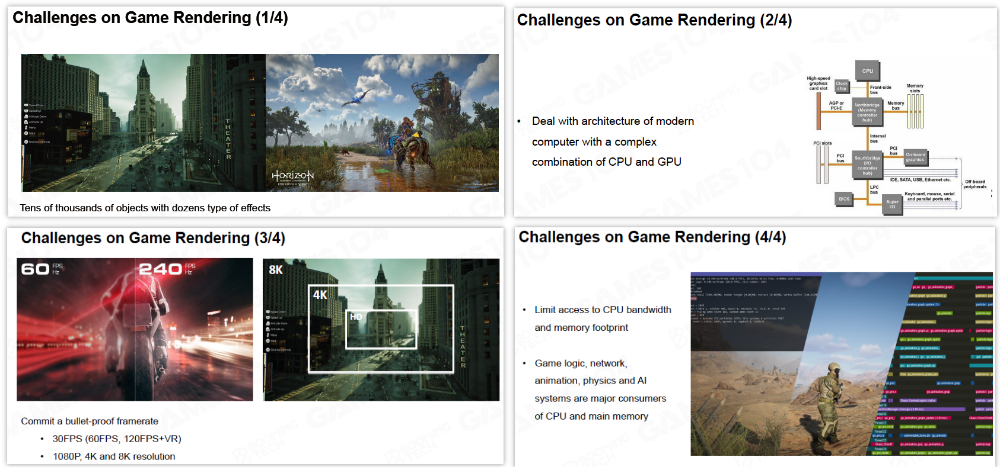

# 游戏渲染面临的挑战

一个容器中同一时刻有大量的游戏对象需要进行渲染，并且不同对象（流体、毛发、玻璃、金属等）渲染的形式、算法还有所差异，这些使得游戏的绘制系统变得非常复杂；

其次，游戏引擎的渲染还要与当代的硬件适配；

同时，游戏引擎需要保证渲染的稳定性，即使进入非常巨大复杂的场景，也要在至少 1/30ms 内完成绘制，随着玩家需求的提高，这一时间甚至可能被缩短到 1/60ms、1/120ms 之内；而且显示器的发展也逐渐将 4K 屏幕普及，甚至于 8K；

游戏引擎的渲染还要考虑到可用的计算资源，一般渲染可用资源只能占到 10%-20%左右，还需预留资源用于 GamePlay 等系统。

# 课程大纲

# 渲染的要素

## 渲染管线

首先输入三维空间的顶点坐标，经过 Model，View 和 Projection（投影变换，将每个图元的 x、y 坐标转换到屏幕坐标系中） 的变换，最终得到投影到二维平面的坐标信息(同时为了 Zbuffer 保留深度 z 值)。

在屏幕空间中，将所有的顶点按照原几何信息，变成三角面，每个面由 3 个顶点组成。

光栅化阶段：经过视图和投影变换后，得到的二维平面将会是中心点在原点、边长为 2 的正方形，视口变换就是将该正方形重新拉伸为实际的长方形，并将左下角移动到原点的过程，便于将像素值存储到二维矩阵中。接着**需要把这些三角形打碎打成像素并且告诉每个像素的值是多少然后显示在屏幕上**，这一个完整的过程我们称之为**光栅化（Rasterization）**。

[现代计算机图形学基础二：光栅化（Rasterization）](https://zhuanlan.zhihu.com/p/450540827)

着色：确定每个像素点或者说片元(Fragement)的颜色。在每一个像素点上找到对应的材质、纹理和光照结果等。

# 理解 GPU

对于图形程序中的复杂计算，我们交由另一独立硬件处理——GPU，也正是 GPU 不断的发展进步，才有了现在越来越精致的画面。

## SIMD and SIMT

- SIMD 指单指令多数据流（Single Instruction Multiple Data），一般是用于处理矩阵变换等复杂运算
- SIMT 指单指令多线程（Single Instruction Multiple Threads）,一条指令交由多个线程处理，这即是 GPU 算力远高于 CPU 的原因

## GPU 架构

- 图形处理集群（Graphics Processing Cluster），用于计算、光栅化、着色、纹理处理的专用硬件块
- 流式多核处理器（Streaming Multiprocessor），作为 GPU 的一个组成部分，用于运行 CUDA
- 纹理单元（Texture Units）用于采样和过滤纹理的纹理处理单元
- CUDA 核心 ，允许不同处理器同时处理数据的并行处理器

## **CPU 到 GPU 的数据流**

数据在不同的运算单元之间读取传输是十分消耗资源的，所以一般只让数据由 CPU 单向流动到 GPU，且尽可能不从显卡中读取数据。

## 缓存

我们在存放数据时一般**集中存放**，就是为了便于缓存的读取，即缓存命中数据（Cache hit）；若缓存不断的无法读取数据（Cache miss），不断的重新读取，将会大大降低处理的效率。

现代计算机的结构就是一条流水线，每一个环节的效率低下都可能限制整体的表现。

# Renderable 可渲染对象

首先区分一个概念：游戏对象 GO 是一个逻辑表达，和真实的可渲染的东西是不一样的。而在 GO 的组件中，有一个 MeshXXXComponent，保存有\***\*Renderable，\*\***这是渲染系统核心的数据对象

## 构建 Renderable

包括 Mesh 几何形体、材质、纹理、法线等等

## 网格图元 Mesh Primitive

起初的网格体数据储存方式并不高效，它储存每个点的位置，法线朝向等属性，进而储存每三个点组成的三角形的数据，而这一个个三角形的数据便构成了这个网格体的数据。

因为每个顶点是由多个三角形公用的，所以我们可以通过只储存每个顶点的数据和对应的索引值，绘制三角形时根据索引值顺序绘制来提高效率。另外，可以将三角形顶点按照顺序存储，那么顶点索引也是按照顺序，这将会有利于提高缓存命中率。

## **为什么每个顶点都需要定义法线方向？**

当绘制表面有折线时，可能会出现顶点位置一样，但法线方向完全不同的情况，所以**每个顶点都需要单独定义法线方向**。

## 材质 **Materials**

材质决定了物体的外观和被光线照射时的表现。分为视觉材质和物理材质（摩擦系数、弹性反弹力），一般在渲染系统中定义的都是视觉材质，后者会单独定义。下图是著名的材质模型：

**纹理（Texture）**是材质的一种非常重要的表达方式，而同时**着色器（shader）**会编译成数据，会和 mesh 存储在一起，在绘制时传入程序控制像素点的颜色，也是可渲染对象的重要组成部分。

# 在引擎中渲染物体

## 坐标系统与变换

物体的自身坐标系 `—模型变换—>` 世界坐标系 `— 相机变换—>` 相机坐标系 `—投影变换—>` 裁剪坐标系 `—视口变换—>` 屏幕坐标系

## 子网格**SubMesh**

我们根据 Mesh 的材质不同将其分为许多子网格（SubMesh），每个子网格都对应与自己的纹理和着色器。每个子网格存储一个 Offset 值，在计算时只需要通过对应的 Offset 值便可知道该部分三角形使用的材质。

## **资源池（Resource Pool）**

在储存时，为了节省资源以及方便相同资源的复用，我们会将每个游戏对象切分为 Mesh、Material、Shader 等，并将相同类型的资源储存到一个统一的资源池中去管理，比如 Material 类型的资源统一储存在 Material 类型对应的资源池中。

相应的，每一个游戏对象也就是这些资源的实例化组合（**Instance**）。

为了提高速度，我们可以将资源池中可复用的资源按照材质分类后再传入 GPU 中（即将同样材质的 SubMesh 归结在一起）。

GPU Batch Rendering 的思想：注意到游戏中许多子物体也是相同的，我们也可以利用上面的策略，在一次绘制指令中，创建许多对象，但只传入一次 Vertex Buffer 和 Index Buffer，通过避免重复传入来提高速度。

## 可见性剔除 Visibility Culling

[渲染前 CPU 和渲染中 GPU 的裁剪和剔除](https://codeantenna.com/a/5oSMDVB2H5)

游戏世界中一般只绘制视锥中的物体，这是就需要检测物体的可见性。通过给每个场景物体预先计算好包围盒，我们可以用一些非常轻量的算法完成物体级别的遮挡剔除，其中包括视锥剔除，这可以大大减少 GPU 的工作量。以下是几种简单的包围盒模型：

### Hierarchical View Frustum Culling

四叉树和 BVH 的方法进行层次剔除，下图是游戏引擎中 BVH 的构建：

### **Potential Visibility Set**

当玩家每经过一个 Portal 时，就只绘制当前所在的 Zone 内可以看见的其他 Zone，这一思想可以用于动态载入场景

### GPU Culling

随着硬件升级，GPU 也可以用来做剔除工作——通过 GPU 对不同面之间的交集的快速计算，以此来裁剪剔除无需渲染的面。另外有一种 Early-Z 的思想做深度测试，也利用了 GPU。

# **纹理压缩（Texture Compression）**

在游戏引擎的渲染系统中，对传统的图片压缩格式（如 JPG、PNG）采样无法实现随机访问其中的一个点，并且采样的计算十分复杂。

因此游戏引擎中一般采用块压缩（Block Compression），最经典的是将图片切分为 4\*4 的四个小块儿去压缩。

这种压缩使得我们只需要知道图片中像素的极大值和极小值以及其他像素相对两者的插值的坐标，便可以得到与原来图片相近的像素颜色。

# 模型生成工具

- 建模（Polymodeling）：3DMax、maya、blender
- 雕刻（Sculpting）：z-brush
- 三维扫描重建（Scanning）
- 程序生成（Procedural modeling）：Houdini、Unreal

# Cluster-Based Mesh Pipeline

随着开放世界、3A 大作的流行，模型的细节、精度也越来越高，也就需要新的模型管线 Cluster-Based Mesh Pipeline。

基础思想：现代 GPU 可以高效地基于数据创建几何细节，那么该算法就是将一个高精度模型按规律分为许多簇（Cluster），一簇可以是 32、64 个面片，这种细分使得 GPU 处理的都是相同大小的小块，可以对随机的簇进行绘制指令，并根据深度进行排序。每个簇都有自己的包围盒，GPU 可以实时计算出该物体某个部分将会被裁剪掉。

Unreal 的 Nanite 就是上述思想细分到像素级别的体现，也是上述思想的工业化体现

> 如何做到最好的优化：通过算法，让计算机尽可能最少地做事情

# 其它问题

## 引擎中的 Instance 案例

Game Object，游戏音效、粒子系统等等

## Mesh shader、clustered mesh 未来会如何发展？

硬件功能一定越来越复杂，将复杂的游戏世界拆解为一个个固定小单元去并行计算，可能是以后发展的方向

## 引擎有必要自己写渲染管线吗？

随着业界积累，最好的办法是学习当前最主流的管线构建方法在引擎中实现，特别特殊的渲染管线实现和维护会比较艰难。

## 图形代码 debug 方法？

将一个算法拆解为多步来实现，有利于代码回退

# 总结

- 游戏引擎的设计与硬件架构的设计紧密关联
- 游戏引擎的一个核心问题是 Mesh、Materials 等数据之间的关系
- 为了优化性能，要设计 Culling 算法使得尽可能少的东西需要绘制
- 随着 GPU 不断的发展强大，可以将任务更多的交由 GPU 处理
