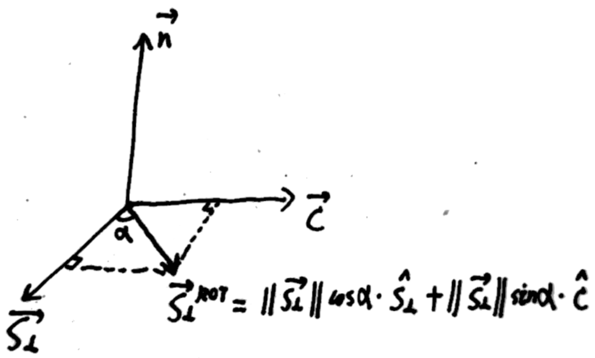
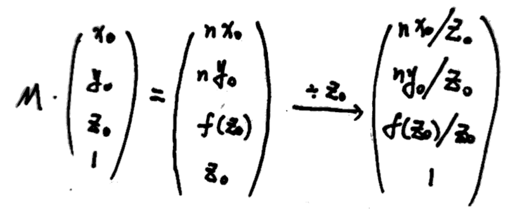
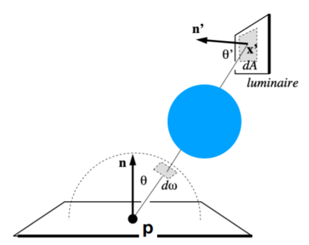

# Rodrigues 旋转公式

## 概要

实现某三维物体的坐标绕过原点的向量轴**n**（默认过原点），旋转 α 角度（右手定则的四指方向）的旋转矩阵为 R(**n**,α)，其表达形式为：


该旋转矩阵左乘三维物体上的某个点（列向量、列矩阵）即可得到旋转变换后的点。

## 推导过程

> 说明：字母上带有`→`表示向量，不带箭头表示该向量对应的列矩阵；字母上的`^`表示该向量的单位向量。

#### Step1

将**S**向量分解为旋转轴**n**方向和垂直于旋转轴方向的两个向量，其中`I`表示旋转轴的单位列矩阵


#### Step2

求出与旋转轴**n**和向量**S**所在平面垂直的向量**C**


#### Step3

将**S**在垂直于旋转轴的分量向**C**旋转 α 度


#### Step4

上一步得到的向量与**S**在旋转轴的分量相加，得到旋转后的向量，由于两个向量的叉乘可以写成一个矩阵乘以列向量的形式（证明略）


整理与提取，即可得到旋转矩阵 R（A 为单位矩阵）：


---

# 透视投影变换坐标变化证明

## 概要

透视投影是利用相似三角形原理将远处平面坐标映射到相机可见的窗口处：


但该过程可以等价为：可以看作先将远处的平面压缩为等同于相机可见的窗口大小的平面，得到一个长方体，然后再进行正交投影得到以原点为中心的边长为 2 的立方体


这个压缩过程规定：近处的平面的大小和位置永远不变；远处平面的大小会被压缩，但远近（z 值不变）；远处平面的中心点在压缩后也不变。那么对于近处和远处平面中间的点，其坐标是向远处平面靠近的，下面给出证明。

## 证明过程

#### Step1 透视投影变换矩阵形式

该矩阵的推导过程见[课程 PPT](https://sites.cs.ucsb.edu/~lingqi/teaching/resources/GAMES101_Lecture_04.pdf)，下面直接给出其形式：


#### Step2

初始点经过变换后得到新坐标，其中 z 方向的新坐标为`f(z0)/z0`



#### Step3

判断新坐标与初始坐标的 z 方向的大小，记为函数`g(z0)`


最终得到 g(z0)始终<0，即新坐标小于初始坐标，由于视角方向是-z 方向，可以得到中间点是向远处平面靠近的。

# 重心坐标插值——透视投影矫正


## 问题来源

-   世界坐标下的三角形 $\triangle{ABC}$ 投影到屏幕空间对应的三角形为$\triangle{A'B'C'}$ 。
-   在光栅化的时候需要知道屏幕空间三角形内某点 $P'$ 的深度值 ，我们目的实际是——获得 $P'$ 对应在世界坐标下的 $P$ 的深度值 。
-   通过重心坐标插值来获得 $P$ 的深度值 ，即(**世界坐标下**)：

    $$
    	Z_P = \alpha Z_A + \beta Z_B + \gamma Z_C
    $$

-   世界坐标下的 $\alpha 、\beta 、\gamma$ 不方便获取，于是直接拿到的是屏幕坐标下的 $\triangle{A'B'C'}$ 坐标，因此可以直接求出 $\alpha '、\beta ' 、\gamma '$ 进行插值，即(**屏幕坐标下**)：

    $$
    	Z_P = \alpha ' Z_A + \beta ' Z_B + \gamma ' Z_C
    $$

-   但是透视实际上是一种近大远小的视觉现象，离视点远的部分会被缩放得更加厉害，所以需要对这个结果进行所谓的插值校正。

## 矫正公式推导

根据重心坐标插值：

$$
Z_{P}=\alpha Z_{A}+\beta Z_{B}+\gamma Z_{C}=\left[\begin{array}{lll}
Z_{A} & Z_{B} & Z_{C}
\end{array}\right]\left[\begin{array}{l}
\alpha \\
\beta \\
\gamma
\end{array}\right]
$$

$$
Z_{P'}=\alpha ' Z_{A'}+\beta ' Z_{B'}+\gamma ' Z_{C'}=\left[\begin{array}{lll}
Z_{A'} & Z_{B'} & Z_{C'}
\end{array}\right]\left[\begin{array}{l}
\alpha ' \\
\beta ' \\
\gamma '
\end{array}\right]
$$

由重心插值公式的性质推导：

$$
    	1 = \alpha ' + \beta '  + \gamma '
$$

$$
\begin{array}{l}
\frac{Z_{P}}{Z_{P}}=\frac{Z_{A}}{Z_{A}} \alpha^{\prime}+\frac{Z_{B}}{Z_{B}} \beta^{\prime}+\frac{Z_{C}}{Z_{C}} \gamma^{\prime}
\end{array}
$$

$$
\frac{Z_{P}}{Z_{P}}=\left[\begin{array}{lll}
Z_{A} & Z_{B} & Z_{C}
\end{array}\right]\left[\begin{array}{c}
\frac{1}{Z_{A}} \alpha^{\prime} \\
\frac{1}{Z_{B}} \beta^{\prime} \\
\frac{1}{Z_{C}} \gamma^{\prime}
\end{array}\right]
$$

$$
{Z_{P}}=\left[\begin{array}{lll}
Z_{A} & Z_{B} & Z_{C}
\end{array}\right]\left[\begin{array}{c}
\frac{1}{Z_{A}} \alpha^{\prime} \\
\frac{1}{Z_{B}} \beta^{\prime} \\
\frac{1}{Z_{C}} \gamma^{\prime}
\end{array}\right]Z_{P}
$$

$$
Z_{P}=\left[\begin{array}{lll}
Z_{A} & Z_{B} & Z_{C}
\end{array}\right]\left[\begin{array}{c}
\frac{Z_{P}}{Z_{A}} \alpha^{\prime} \\
\frac{Z_{P}}{Z_{B}} \beta^{\prime} \\
\frac{Z_{P}}{Z_{C}} \gamma^{\prime}
\end{array}\right]
$$

得到如下结论（**重要结论**）：

$$
\frac{Z_{P}}{Z_{A}} \alpha^{\prime}=\alpha ，
\frac{Z_{P}}{Z_{B}} \beta^{\prime}=\beta ，
\frac{Z_{P}}{Z_{C}} \gamma^{\prime}=\gamma
$$

其含义是某一点 $P'$ 在屏幕空间下的重心坐标 $(\alpha ' , \beta ' , \gamma ')$ 对应于世界坐标点 $P$ 的重心坐标变成了 $(\frac{Z_{P}}{Z_{A}} \alpha^{\prime} , \frac{Z_{P}}{Z_{B}} \beta^{\prime} , \frac{Z_{P}}{Z_{C}} \gamma^{\prime})$ 。

由于重心坐标相加为 1：

$$
\frac{Z_{P}}{Z_{A}} \alpha^{\prime}+\frac{Z_{P}}{Z_{B}} \beta^{\prime}+\frac{Z_{P}}{Z_{C}} \gamma^{\prime}=1
$$

得到正确的深度值：

$$
Z_{P}=\frac{1}{\frac{\alpha^{\prime}}{Z_{A}}+\frac{\beta^{\prime}}{Z_{B}}+\frac{\gamma^{\prime}}{Z_{C}}}
$$

接下来的步骤就是求屏幕空间的点 $P'$ 的重心坐标 $\alpha ' 、 \beta ' 、 \gamma '$ 代入上述公式得到其实际对应的深度值。

## 通用属性插值

正确得出深度的插值结果之后，再看看任意属性（法线向量，纹理坐标等）插值结果，设 $I_P$ 为要插值求得的在屏幕空间中 $P'$ 点所对应到世界坐标 $P$ 点的属性。

对于 $\triangle ABC$ ，根据重心坐标插值有：

$$
I_{P}=\alpha I_{A}+\beta I_{B}+\gamma I_{C}=\left[\begin{array}{lll}
I_{A} & I_{B} & I_{C}
\end{array}\right]\left[\begin{array}{l}
\alpha \\
\beta \\
\gamma
\end{array}\right]
$$

根据上述重要结论有：

$$
I_{P}=\left[\begin{array}{lll}
I_{A} & I_{B} & I_{C}
\end{array}\right]\left[\begin{array}{c}
\frac{Z_{P}}{Z_{A}} \alpha^{\prime} \\
\frac{Z_{P}}{Z_{B}} \beta^{\prime} \\
\frac{Z_{P}}{Z_{C}} \gamma^{\prime}
\end{array}\right]
$$

最后整理一下：

$$
I_{P}=\left(\frac{\alpha^{\prime}}{Z_{A}} I_{A}+\frac{\beta^{\prime}}{Z_{B}} I_{B}+\frac{\gamma^{\prime}}{Z_{C}} I_{C}\right) Z_{P}
$$

# 蒙特卡洛路径追踪算法



```cpp
// 着色算法
shade(p, wo)
	// Contribution from the light source.
	L_dir = 0.0
	Uniformly sample the light at x’ (pdf_light = 1 / A)
	Shoot a ray from p to x’
	If the ray is not blocked in the middle
		L_dir = L_i * f_r * cos θ * cos θ’ / |x’ - p|^2 / pdf_light

	// Contribution from other reflectors.
	L_indir = 0.0
	Test Russian Roulette with probability P_RR
	Uniformly sample the hemisphere toward wi (pdf_hemi = 1 / 2pi)
	Trace a ray r(p, wi)
	If ray r hit a non-emitting object at q
		L_indir = shade(q, -wi) * f_r * cos θ / pdf_hemi / P_RR
Return L_dir + L_indir
```
