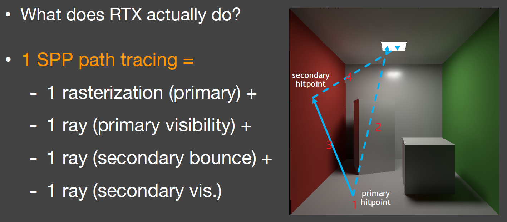

# RTRT(Real-Time Ray Tracing)介绍

## 光追硬件 RTX

RTX其本质上只是硬件的提升，并不涉及任何算法部分，其本身是作为硬件上的一个突破，因为在显卡加装了一个用来做光追的部件。

由于光线追踪做的是光线与场景的求交，结合games101我们知道光线要经历BVH或者KD-tree这种加速结构，也就是做一个树的遍历从而快速判断光线是否与三角形求交，这部分对于GPU来说是不好做的，因此NVIDA设计了专门的硬件来帮助我们每秒可以trace更多的光线。

虽然trace那么多光线，但一根光线并不代表一个光路样本。RTX每秒可以trace 10 Giga（$1Giga=10^9$）的rays，也就是100亿根光线.，看起来虽然多，但是要对每个像素都trace，因此：

- 除以分辨率，比如1K或者2K
- 还要除以每秒的帧数
- 而且我们并不是用所有的时间都只去做光线追踪，剩余的时间我们还需要做降噪，后期处理，gameplay本身，因此1秒中并不是全部时间都在做ray tracing

10 Giga rays per second == 1 sample per pixel，其实就是每个像素采样一个样本，从而得到最后的光追结果，记为**1SPP**。

**什么样本是一个光路的样本?**

至少要有四条光线才能构成一个最基本的光路：

- primary hitpoint(从camera出发打出一根光线打到的交点)。之所以为rasterization，是因为光栅化与primary ray做的工作是一样的，与其每个pixel去trace一条primary ray，不如直接将整个场景光栅化出来，二者是等价的。光栅化得到的结果等价于每个pixel都穿过了一条ray，而且光栅化更快。
- shadow ray(primary hitpoint 和光源之间连接进行light sampling并判断是否有遮挡)
- secondary ray(在Hitpoint根据材质采样出一个方向打出一根光线，他会打到一个物体上从而得到secondary hitpoint)
- secondary shadow ray(从secondary hitpoint与光源连接判断是否会被光源看到)

我们知道path tracing本身是一种蒙特卡洛积分的方法，本身会产生噪声，我们采样的样本越多，其噪声越小，因此1spp最后会得到一个很noisy的结果。

于是，RTRT最核心的技术便是——**降噪**

实时光线追踪与path tracing相比，只是进行了一算法上的些简化，算法的核心思路不变，它本身的突破是由于硬件的能力提升，且1 spp是在20系列时的特点，现如今的30系列可能会支持更多的spp.

## 实时去噪方法现状

从图中我们可以知道，即使是1spp得到的这么糟糕的结果，通过降噪（中间部分）我们仍然可以得到一个很棒的效果。

**首先我们需要知道在1spp下我们想要得到的结果：**

降噪的方法有很多，但是针对实施光线追踪的降噪方法很少，那么工业界是如何解决这个问题的呢？首先介绍两种降噪方法的原理：时域滤波和空间滤波，之后介绍工业界的解决方案：SVGF和RAE。

# 时域滤波原理

## **核心思想——Temporal**

**假设：整个看的场景的运动是连续的，就是camera以某种轨迹看向不同的物体，帧与帧之间有大量的连续性。**

**Motion vector：它是用来告诉我们物体在帧与帧之间是如何运动的，也就是图中的A点在motion vector下可以知道在上一帧里A点对应的位置B点，它是在Image Sapce中的2D向量。**

- 我们认为当前帧是需要去进行filtering，**前一帧是已经filtering好的**
- 利用motion vector来知道当前帧某一点在上一帧的对应位置
- 由于我们认为场景运动是连续的，所以认为shading也是连续的，上一帧得到降噪好的结果比如颜色之类的，可以在当前帧复用，相当于增加了spp，但并不是简单的上一帧1 spp+当前帧1 spp。由于是一个递归，上一帧也复用了上上一帧的结果，可以理解为一个指数衰减，每一帧都有百分比贡献到下一帧
- 这种方法叫做**时间上的复用**：通过在找某一点在不同帧上的对应关系去复用已得到的结果。（空间上的复用见下文）

**Temporal根据motion vector去找对应关系。**

## **几何缓冲区  G-Buffers**

在介绍具体细节之前，我们引入几何缓冲区的概念——G-buffer（Geometric Buffer）。

在screen space我们可以得到很多的信息，比如之前的screen space ray tracing我们在screen space得到了每个点的深度相当于从camera看去我们得到了一张深度图.

同样的我们不止可以通过screen space生成深度图，还可以生成：

- 直接光照图，
- 法线图
- 每个点的diffuse Albedo(也就是颜色kd项)
- 也可以存储per pixel depth，normal，世界坐标(通过rgb三通道来存x，y，z)等，只需要将这些信息各自生成一张图存储在G-buffer里，当需要的时候拿出来用

即在渲染过程中可以免费得到的额外信息。

**G-buffer存储的只是screen space的信息，因为其记录的是camera能看到的信息**

## 反向投影 **Back projection**

- frame i——当前帧
- frame i-1——上一帧

**如何找当前帧的一个像素在上一帧的哪里**?

**前提**：我们找的不是像素的位置，而是当前帧的某一个像素里包含的内容在上一帧的哪一个像素。即透过当前帧(frame i)中蓝点这个像素我们所得到的点的世界坐标，投影到上一帧(frame i-1)中对应的是哪个像素。

Back Projection方法就是为了得到当前帧的坐标$x$去求对应于上一帧的坐标$x'$：

- 要求出这个点的世界坐标，如果G-buffer中有世界坐标信息的图，可以拿来直接用
- 如果没有我们可以计算得到。一个点的世界坐标需要通过MVP矩阵和视口矩阵（E）从而得到在screen space上的坐标，那么让screen space上的这个点按相反的顺序乘以对应的逆矩阵就得到了世界坐标。(s是世界坐标，x是screen space的坐标，由于在screen space是2D坐标，因此我们需要深度这一信息来作为z值）

$$
s=M^{-1}V^{-1}P^{-1}E^{-1}x
$$

- 到此我们求出了这一点的世界坐标，对于它在上一帧的哪里，由于我们知道整套渲染的流程，因此对于每一帧之间是怎么移动的，只需要用将当前帧世界坐标$s$乘以帧移动的逆矩阵$T^{-1}$就得到了上一帧中这个点的世界坐标$s'$
- 到此，得到了发生移动后的上一帧的点的世界坐标$s'$，接着需要将其变回屏幕坐标上，即乘以MVP矩阵和视口矩阵（由于我们是控制着渲染的整个流程，因此每个矩阵都是已知的）

$$
x'=E'P'V'M's'
$$

## 时域累积与降噪 **Temporal Accum./Denoising**

定义:

- **~** ：unfiltered 表示没有filter，具有噪声的内容
- -：filtered 表示没有噪声或者噪声比较小的内容

时间上的降噪：在得到了motion vector之后，我们就可以把当前帧(noisy的图)和上一帧(没有noisy的图)结合在一起，最简单的方法就是线性blending在一起，比如上一帧的结果 * 0.8 + 这一帧的结果 * 0.2得到新的结果。$\alpha$平衡系数表示当前帧的贡献，在0.1-0.2之间。

](Games202实时光追降噪/Untitled%208.png)

## 小结

时间上的降噪的过程：

1. 如果在进行rasterization(primary ray)时得到了世界坐标信息的图存储在G-buffer中则直接得到世界坐标
2. 如果没有其信息，则在当前帧的像素通过逆视口变换和逆MVP变换得到世界坐标
3. 已知motion矩阵，将世界坐标逆motion得到上一帧的世界坐标
4. 将上一帧的世界坐标进行正MVP变换和视口变换得到当前帧中的像素在上一帧中的位置
5. 将两个值线性blending起来从而得到当前帧最后的结果

**注意：滤波绝不会让一张图变暗或者变亮**

## 时域降噪的失败情况 **Temporal Failure**

### 失败情况1：切换场景

- 如果突然切换场景，由于上一帧并没有新场景的任何信息，因此得到的结果肯定不准确。
- 如果突然切换光源，假设在迪厅中场景中任何物体都不变换，只是将红灯忽然变为绿灯，由于上一帧中的信息光源为红色，因此如果复用会导致我们得到的结果偏红而不是偏绿，因此时间的复用在此不可用。

因此需要一个时间也就是burn-in period，去累计个新场景的几帧信息以供后续进行复用。

### 失败情况2：走廊中向后移动

如上图，如果camera从离门最近开始倒退，在倒退的时候周围的信息会不断增多，因此我们当前帧新出现的物体无法在上一帧的屏幕空间内找到相对应的点，会对复用产生影响。

### 失败情况3：突然出现被挡住的背景

图中，左边为上一帧，右边为当前帧。

](Games202实时光追降噪/Untitled%2012.png)

当求箱子后遮挡部分的两帧屏幕对应位置会发现，上一帧中找不到在当前帧中新出现的被遮挡的背景，找到的却是前面的遮挡物箱子，这就是disocclusion(不遮挡)问题。

### 其它失败情况

- **阴影拖影**：移动光源下的静止场景。我们认为光源从左到右移动，而**柱子是不动的**，因此我们知道任何一个像素的motion vector是0，但是由于我们一直在复用未移动的帧结果，就会导致拖影的阴影出现。

](Games202实时光追降噪/Untitled%2013.png)

- **反射滞后**：在产生了反射现象的场景中移动物体，反射面静止。下图对于这种地板上反射出场景的情况来说，由于**地板是不动的**，因此其上面的每一个像素点的motion vector为0，当我们移动物体时，其地板需要一定的时间适应，之后再在地板上反射出当今场景中的物体，也就是反射滞后。

](Games202实时光追降噪/Untitled%2014.png)

以上问题是在着色的过程中发生的错误现象，因为在着色时需要追踪的是着色现象的变换，而不是几何的变换，此时motion vector为0，因此无法复用。

## 拖影问题及其解决思路 Lagging

对于上述的失败场景，会导致的一个严重问题——拖影（拖尾）

对于上一帧的东西参考了80%甚至更多，自然会产生这种残影/拖尾的现象。

### Lagging的解决方案

- **Clamping**

思路：如果在任何时候都把上一帧的结果，先给拉近到当前帧的结果就使得二者之间的颜色很相似，从而弱化了这一不正确的现象。

解释：以刚才的黄色箱子和白色墙壁为例，因为当前帧里取了过多的黄色箱子的值才导致了残影出现。上一帧的黄色，我们把它拉近白色，然后再将二者线性blending，这样我们得到的结果仍然是接近于白色的。

- **Detection**

思路：事先判断是否仍要使用上一帧的结果

解释：以黄色箱子和白色墙壁为例，当做完motion vector之后，我们增加一步操作来判断所对应的是不是同一个物体，在工业界在渲染中认为每个物体都有自己的编号，如果编号不同，那么认为motion vector就不再适用了。

此时就对$α$进行调整，可以认为$\alpha$是非0即1，0%上一帧，100%这一帧。

但是之所以引用上一帧是因为其没有噪声，如果100%相信当前帧相当于重新引入了噪声，于是我们可以将当前帧的filter变大一点，让结果模糊一点但减少了噪声，这是没有关系的。

****以上两种方法可以单独或合并使用。****

## 关于Temporal的其它

- 时间上的抗锯齿 ：Temporal Anti-Aliasing (TAA)，与时域滤波（降噪）非常相似，是复用上一帧来增加自己的采样数来抗锯齿。
- 用到Temporal的技术一般的思路都是相似的，包括DLSS等
- 工业界对于Temporal技术失败的情况会通过其它方式进行解决，该技术依旧是广泛应用的
- 如何降低Temporal的失败情况？《[Temporally Reliable Motion Vectors for Real-time Ray Tracing](http://sites.cs.ucsb.edu/~lingqi/publications/paper_trmv.pdf)》研究了如何去追踪着色过程的变换，来解决阴影拖影、反射滞后等问题。（该论文可以在闫令琪老师的主页找到：[Lingqi Yan: Research Homepage (ucsb.edu)](http://sites.cs.ucsb.edu/~lingqi/)）

# 空间滤波原理

在时域上复用了之前的帧，而当前帧如何进行滤波，就是该部分所讨论的问题。

## 滤波的实现 **Implementation of filtering**

### 高斯滤波 Gaussian **Filtering**

滤波：概括起来就是做了一个模糊的操作，把一些噪声消除。

上图用的是低通滤波器，也就是只保留低频的信息，除掉高频的信息，这会带来两个问题：

- **高频信息中就全是噪声吗？那么高频中不是噪声的信息被除掉会不会导致信息丢失？**
- **低频信息中就没有噪声吗？**

这两个问题后续进行讨论，这里先讨论如何实现滤波。

- 未处理过的图记做 $\tilde{C}$；
- 一个滤波器到底在做什么，由滤波核来定义，记做K；
- 处理过的图片记做 $\bar{C}$

一般来说我们为了给光线追踪由于蒙特卡洛产生的噪声降噪时，用的是高斯的滤波器，它的滤波核类似于正态分布，中心值高，向两边衰减：

这里将中心像素称为$i$，其余的像素称为$j$，像素$j$肯定会贡献给$i$，具体贡献多少通过$i$和$j$之间的距离在高斯上找对应的值，从而知道$j$会贡献多少给$i$，伪代码：

伪代码解析:

- 对于任何一个中心像素i
    - 我们需要定义权值和(sum_of_weights)，加权贡献值的和(sum_of_weighted_values)
    - 对于中心像素i周围一圈的任意像素j(包括像素i本身)
        - 根据像素i和像素j之间的距离和高斯的σ找对应的j贡献给i的值(权值) w_ij
        - 将权值w_ij与像素j对应的颜色rgb值相乘得到j的加权贡献值，并加到sum_of_weighted_values里
        - 将权值加到sum_of_weights
    - 进行归一化sum_of_weighted_values/sum_of_weights从而得到像素i最终的结果

注意：

- 不论是积分式还是求和式，把求平均的操作写成sum_of_weighted_values/sum_of_weights是没问题的。提到归一化我们在之前将渲染方程中的visibility拆出来后要对visibility进行一个积分并除以一个空积分来进行归一化处理（分子是一个加权的visibility求和，分母则是权的求和），即sum_of_weighted_values/sum_of_weights。
- 高斯的滤波核下，sum_of_weights不会为0，但在其他的滤波核下可能会为0，因此在进行归一化从而得到像素i最终的结果之前通常会判断，sum_of_weights是否为0，如果为0则直接使像素i的值为0。
- 像素j输入的值i可能是一个多通道的值（RGB颜色值），也就是sum_of_weighted_values可以是一个多通道的值。

### 双边滤波 **Bilateral filtering**

从图中可以看到，通过高斯我们得到了一个整体都被模糊的结果，但是**如果想让边界仍然锐利**该如何操作？因此除了高斯我们需要其他的方法来帮助我们保留下边界的这些高频信息。

因此引入了一个新的滤波核或者叫做滤波的方法，叫双边滤波(Bilateral filtering)。根据观察经验，可以**将颜色变化特别剧烈的地方认为是边界**。

具体做法如下：

- 如果二者颜色差距不是特别大，则继续用高斯处理$j$到$i$的贡献
- 如果像素$i$和像素$j$之间的颜色值差距过大，可以认为**这两个像素分别在边界的两边**，所以希望让像素$j$给$i$的贡献变少，就不会出现边界的模糊情况，其实只需要在高斯的滤波核上添加更多控制条件：

$$
w(i, j, k, l)=\exp \left(-\frac{(i-k)^{2}+(j-l)^{2}}{2 \sigma_{d}^{2}}-\frac{\|I(i, j)-I(k, l)\|^{2}}{2 \sigma_{r}^{2}}\right)
$$

- 在这里$(i,j)$代表一个像素坐标，$(k,l)$代表另一个像素坐标，在公式的指数第一项中的高斯滤波核中用到。
- $I(i,j)$表示第一个像素的值，$I(k,l)$表示第二个像素的值，之间的差异就是公式指数第二项的控制因子的分子部分，如果差异过大，就相当于在原本的高斯核上乘上了**负的距离的平方**，那么距离差异越大，使得公式整体的贡献变小接近于0。

得到的效果如下：

](Games202实时光追降噪/Untitled%2023.png)

### 联合双边滤波 ****Joint Bilateral filtering****

通过上面对于滤波的实现，可以发现：

- 高斯滤波 Gaussian filtering: 1 metric (distance)。****一个标准：通过判断两个像素之间的绝对距离来查找其需要贡献多少****
- 双边滤波 Bilateral filtering: 2 metrics (position dist. & color dist.)。****两个不同的标准：两个像素之间的距离、颜色之间的距离，从而在只保留低频信息时候保留了边界的信息****

那么我们有没有可能利用更多的features来改变滤波核，从而filtering得到更好的结果呢？可以的，这就是**Joint Bilateral filtering联合双边滤波**，而且Joint Bilateral filtering在解决path tracing中由于蒙特卡洛所产生的噪声上有很不错的效果。

在渲染时候，我们可以得到很多免费的信息并存储在G-buffer中，比如**世界坐标、法线、深度等信息**，这些信息都可以对滤波进行一个更好地指导，更重要的是G-BUFFER有一个很好的特点：**完全没有噪声**，这是因为我们在进行rasterization(所有像素的primary ray)时候，可以顺手把一些信息记录下来存到G-BUFFER中，而光栅化不涉及多次弹射，因此不会出现噪声。

注意：

- 联合双边滤波也不需要考虑核是不是normalize的，因为我们在代码中实现时最后会进行归一化操作
- 滤波核不一定必须要使用高斯，只要这个函数满足随着距离衰减，就可以使用，如高斯、指数函数、cos函数。

假设我们在G-buffer中知道三个信息：深度（可以生成深度图）、颜色、法线，下图是在RTRT中得到的结果，可以看到有很明显的噪声：

以A、B两点为例，如果用高斯，我们是通过两个像素之间的绝对距离找对应贡献；双边滤波的话在考虑距离的同时还会考虑两个之间的颜色变化，但是在这里双边滤波是不行的，我们可以看到A和B两个点都是十分noisy的，就算A和B没有在边界的两边，在同侧，它们之间的颜色差异也可能十分明显，这此时双边滤波得到的结果是不准确的。

因此我们引入**深度、法线、颜色值等**来辅助我们做另外的metric。

**从A到B**：

可以从G-buffer得到各自的深度信息，我们可以看到B的深度比较浅，而A的深度比较深，我们不希望A有太多的贡献到B上，因此我们把深度做成一个高斯或者任何随深度衰减的函数去使用。

**从B到C：**

可以从G-buffer得到的是normal信息，因为我们可以看到B、C二者之间的深度是差不多的，因此不能继续使用深度这一metric了。可以发现，它们的法线朝向是不一样的，也就是他们的法线夹角接近于90度，就认为他们之间的法线差异很大。因此我们把Nnormal做成一个高斯或者任何随法线夹角衰减的函数去使用。

**从D到E：**

可以从G-buffer得到颜色值，差异越大，贡献越小。

**联合双边滤波的本质就是在kernel里多算几组不同feature下的贡献，并将其相乘得到最后的结果。**

## 大核滤波器的实现 **Implementing Large filters**

过滤器所做的操作，是对于任何一个像素，考虑周围N * N个像素的贡献值，加权平均之后写回这个像素上。

如果是small filter，如 7 * 7大小的滤波核， 我们把范围内的像素贡献值加权平均值后写回这个像素；但是如果是large filter，如64 * 64，就会使得filter变得特别慢。因此我们的首要任务就是让一个large filter的速度变快，那么该怎么去做呢？工业界有两种应用比较广泛的解决方法：

### 1.滤波核拆分 **Separate Passes**

**目的**

减少纹理查询次数。现在先考虑2D的高斯filter，先不考虑双边和联合双边滤波。

**思路**

对于任何一个像素，我们其实可以不去做一个N * N的filter，假如现在有一张图，我们先将它在水平方向上filter一遍，之后再在竖直方向上filter一遍。换句话说，就是将本来一趟N * N的，分成两趟来做——水平的1 * N和竖直的 N * 1，最后的结果相当于N * N filter的结果，如下图所示。

**对比**

- 如果使用N * N的filter，对于任何一个像素我们需要访问N^2个纹理；
- 如果将其拆分为两趟，第一趟访问N个纹理，第二趟访问N个纹理，总共访问了2N个纹理。

**关键问题**

1. 为什么我们可以把一个2D的高斯filter拆分为两个1D的高斯filter？

因为2D的高斯函数有一个好的性质，在数学上就是拆开定义的，**其本身就是可拆分的**

$$
 G_{2D}(x，y)=G_{1D}(x)\cdot G_{1D}(y)
$$

另外，**滤波 == 卷积（filtering == convolution）**

$$
\int\int F(x_0，y_0)G_{2D}(x_0-x，y_0-y)dxdy=\int(\int F(x_0，y_0)G_{1D}(x_0-x)dx)G_{1D}(y_0-y)dy
$$

我们想要求一个像素周围一圈像素对自己的加权贡献，就相当于我们对2D函数$F$和高斯核在2D上进行一个卷积，由于2D高斯核可以拆分为两个1D的高斯核相乘。

**应用**

**这种做法理论上只适用于高斯**，对于双边滤波，两个高斯相乘，X和Y不容易拆分出来。联合双边滤波要考虑的东西更多，深度，normal各种信息，拆分成X和Y的函数也是很困难的，因为他们的滤波核本身就很复杂了。

而实际上，只要范围不是太大，我们还是可以这样分成水平和竖直去做的。

### 2.尺寸渐增 **Progressively Growing Sizes**

**目的**

同上，不希望对于任何一个像素进行N * N次的纹理查询

**思路**

用一个逐步增大的filter进行多次滤波。

**A-trous wavelet**

A-trous wavelet是一种滤波方法，它的思路是：

- 多趟操作，每趟都是5 * 5大小的filter；
- 每趟滤波核的间隔按照$2^i$来增加。第一趟i=0时，每1个间隔采样一个；第二趟i=1时，每2个间隔采样一个，但filter大小仍旧是5。

假设要做5趟filter，那么第5趟i=5时，样本之间的间隔是 $2^4 = 16$，第5层一共要5个样本，也就是4个间隔，所以在第五层时候相当于做了一个64 * 64的filter，但对于这个像素来说，只做了5趟，每趟5 * 5大小的filter，一共做了 125次的纹理查询，相比于 64 * 64 = 4096次已经很小了。

因此通过这种方法就可以很少的纹理查询次数得到了N * N的filter结果。

**关键问题**

1. 为什么要逐渐增大filter，而不是一上来就使用第5趟中间间隔16个样本的filter？

回顾101学习的关于采样的过程：

](Games202实时光追降噪/Untitled%2029.png)

（a）是时域上的某个信号，到了频域上（b）是一个连续的频谱（Tips：频谱是左右对称的，即使不存在负的频率）

（c）是冲激函数，只在特定时域上有值，反映到频域上是（d）

（e）是冲激函数对（a）进行采样（也就是二者相乘），得到离散的点，反映到频域上是（f）

**采样就等价于把信号在频域上以采样信号的周期进行延拓**。

**走样原理**：之所以会出现走样现象是因为采样比较稀疏，也就是采样点之间的间隔比较大，就意味着频谱之间的间隔小，那么延拓之后会产生频谱重叠的现象从而发生走样。

下面是相关参考资料：

> 关于采样的通俗理解：[https://www.zhihu.com/question/431920644/answer/1597049082](https://www.zhihu.com/question/431920644/answer/1597049082)
> 

> 关于傅里叶变换的通俗理解：[https://zhuanlan.zhihu.com/p/19763358](https://zhuanlan.zhihu.com/p/19763358)
> 

> **采样 == 重复的搬移频谱：**[https://blog.csdn.net/qq_38972634/article/details/119832068](https://blog.csdn.net/qq_38972634/article/details/119832068)
> 

回到问题本身，filter做的其实就是在频域上截取某一段值，丢弃掉其它值。**用更大的filter == 除掉低频信息；用更小的filter == 除掉高频信息**。

在第1趟的时候，通过一个小范围的filter，将频谱上的高频信息，也就是蓝色区域pass掉；

在第2躺的时候，通过一个稍大范围的filter，将频谱上的稍低的频率信息，也就是黄色区域pass掉；

以此类推，不断增加filter的size就是为了不断去除更低的频率。

1. 为什么可以间隔那么多的样本？

在第1趟中除去了高频蓝色区域，然后在第2趟中相当于在9 * 9的filter中采样出 5*5 的filter，而采样的间隔（采样频率）对应到频谱上正好是上图的蓝色部分，于是该次采样就又对应了一次频谱的搬移（延拓），使得搬移的结果变成：在第1趟除掉高频信息后的区域首尾恰好连接，从而避免了走样现象。

## 离群值删除 **Outlier Removal**

### **问题引入**

在用蒙特卡洛方法渲染一张图时，得到的结果会出现一些点过亮或者过暗，这些过亮或者过暗的点如果经过使用filter这种降噪的方法去处理的话其实并不好处理。以7*7的filter为例，如果有一个点过亮，在经过这个7*7的filter处理过后，会影响一块区域，使得它这一块区域都会变亮。

那么是否可以在filter之前处理掉这些过亮或者过暗的点？而且我们如何去定义这个outlier也就是这个边界呢？

### 离群值检测与限定 **Outlier Detection and Clamping**

1. **Detection**

我个人把outlier翻译成”离群值“，通俗说就是非主流的颜色，那么首先要知道它主流的颜色的范围。

因此对于每个像素，都取周围一个小范围的区域，例如7*7或者5*5，然后把这个范围内颜色的均值(mean)和方差(variance)给算出来，然后进行检测：

$$
Value outside[μ−kσ，μ+kσ][\mu - k\sigma， \mu + k\sigma] → outlier
$$

正常的范围在”均值+-若干方差“内，超过这个范围的认为该颜色值是outlier。

2. **Clamping(outlier removal)**

如果我们找到了outlier的点，就把这个点的值给clamp到接近正常范围的值，该操作称为outlier removal。这种操作并不是把outlier的值给舍弃，而是把它限定到正常范围，而且该操作在filter之前进行，从而能得到正确的filter结果。

工业界中对于clamping的操作会更加复杂，如TAA的思想。

在上节中提到，当motion vector为0导致的残影现象，是由于：当前帧与上一帧中对应的信息差异过大。为了避免上一帧的错误信息（如刚出现的墙壁对应到上一帧并不是墙壁的颜色）对当前帧造成影响，就可以使用该方法，称为**Temporal Clamping**。

$\tilde{C}$ ——没有filter过的帧；$\bar{C}$ ——spatial filter过的帧；$C$ ——noisy-free（经历过temporal累积后的无噪声的帧）

**Temporal Clamping所做的操作为**：假设上一帧的结果是noisy-free的，当前帧的结果是spatial filter过的，那么就将上一帧对应点的结果clamp到当前帧对应点周围的有效范围的内。即**在spatial filter之后的当前帧的对应点周围找一个很小的范围，找出均值和方差**，仍然认为 $[μ−kσ，μ+kσ][\mu - k\sigma， \mu + k\sigma]$ 是有效范围，**如果上一帧对应点的颜色值超出这个范围，则把其clamp到范围内**，再和当前帧做线性blending，从而得到当前帧noisy-free的结果。

**注意**

- temporal clamping不是一个解决方法，而是一个介于noisy和lagging的tradeoff
- 该操作是将上一帧的不可信的结果值给clamp到当前帧filter后的正常范围内

# 实时光追降噪-SVGF

## 前言

SVGF（Spatiotemporal Variance-Guided Filtering）从名称可以看出，这是一种时域和空间上的方差来指导滤波的方法。在1spp下可以达到与GT（ground truth）非常接近的效果：

下面介绍其基本思路。

## SVGF-Joint Bilateral Filtering

SVGF使用了三个指导filtering的重要因素。

### 1.深度 **Depth**

以图中的A，B互相贡献为例，如果二者之间的深度差异小，则贡献权值大；反之二者深度差异大，则贡献权值小。

$$
w_z=exp(-\frac{|z(p)-z(q)|}{\sigma_z|\nabla  z(p)\cdot (p-q)|+\epsilon})
$$

这是SVGF用来判断深度贡献权值的公式，从公式中可以看出：

- 由于$exp(x)$是返回$e$的$x$次方，由于公式返回的是$-x$次方，所以差异越大，贡献越小；
- 分母部分的 $\sigma_{z}$ ：是一个用来控制指数衰减的快慢的参数，或者理解为控制深度的影响大还是小；
- $\nabla z(p)\cdot (p-q)$： 深度的梯度 * 两点间的距离；
- $\epsilon$ ：filter时候考虑一个点Q周围所有的点P，也包括这个点Q，因此分母是有可能为0的，而且如果两点足够接近会导致最后的数值太大，为了避免一些数值上的问题加上一个较小量$\epsilon$ 。

**关于$\nabla z(p)\cdot (p-q)$项**

上图中，由于A和B两点在同一个平面上，颜色也相近，理论上A和B会对彼此贡献很大。

但这一面是侧向面对屏幕，因此A和B是有很大深度差异的，此时如果我们用深度来判断A和B对彼此的贡献时候，会发现二者彼此贡献很小，这明显是不合理的。

因此简单的用深度来判断贡献值是不行的，那么考虑A和B在平面法线方向上的深度变化。图中的A和B虽然在实际深度差异很大，但是在法线方向上的深度差异几乎没有，因为二者几乎在同一个平面上。

因此引入了**深度的梯度**——垂直于平面法线上的变化率，$\nabla z(p)\cdot (p-q)$即为 **深度梯度 * 距离 = 实际深度变化量**。

总结来说，通常情况下不会简单的用二者之间的深度差异来判断贡献值，而是在它们所在的面的法线方向上投影出来的深度差异来判断，或者说是在它们所在平面上的切平面（平面的切平面等于平面本身）上的深度差异。

### 2.法线 Normal

$$
⁍
$$

这是SVGF用来判断法线贡献权值的公式，可以看出：

- 用两个点法线向量求一个点积，由于求出来的值有可能是负值，因此使用$max()$把负的值给clamp到0。
- $σ_{n}$ ：用来判断点乘的这个$cos$函数从1到0的变化是快还是慢，$σ_{n}$越大，从1到0就越快，也就是判断法线之间的差异的严格程度。

另外，如果场景中运用了法线贴图来制造凹凸效果，我们再判断时应该**运用平面原本的法线**，而不是为了制造凹凸效果而改变过的法线。

### 3.Luminance

在考虑颜色差异时，最简单就是应用双边滤波里给的颜色差异来考虑，例如将RGB转换为grayscale（灰度），这种颜色称其为luminance，只是一个名字，就认为是颜色。

任意两点间考虑其颜色差异，如果颜色差异过大，则认为靠近边界，此时A和B的贡献不应该互相混合起来。

$$
w_l=exp(-\frac{|l_i(p)-l_i(q)|}{\sigma_l\sqrt{g_{3\times 3}(\mathrm{Var}(l_i(p)))}+\epsilon}
$$

这是SVGF用来判断颜色贡献权值的公式，可以看出分母引入了方差**variance**。

**引入方差的原因**

由于噪声的存在会出现一些干扰，也就是B点虽然在阴影里，但是可能刚好选择的点是一个噪声（表现为颜色特别亮），此时A、B的颜色差异很小，就会互相贡献，但是这样是错误的现象。

先去看A，B两点间的颜色差异，并且计算filter的中心点的variance，当variance比较大时，意味着不应该过多相信两点间的颜色差异，所以把标准差放在分母。

**计算流程**

](Games202实时光追降噪/Untitled%2039.png)

由于variance是一个统计学的量，不可能只看B点本身，假设当前帧渲染出来之后的结果是很noisy的，会做如下操作来得到B点的variance：

- 在空间上，使用À-Trous Wavelet方法，在B点的周围取一个7*7的区域算出区域里的variance
- 在时域上，当前帧（A、B均为当前帧）去找上一帧中对应点的variance，这个值是在时间上累积下来的，即计算平均，将方差变得时域上平滑
- 并且上一步得到的时域上的方差大小又在后续去更好的指引Spatial Filter在不同噪点区域的力度

**********失败情况********** **Failure Case**

依旧存在上文提到的**阴影拖影的现象**。当一个场景固定，只移动光源时候，阴影会随着光源的移动而变化，当前帧会复用上一帧的阴影，但由于没有发生任何的几何变换，因此motion vector等于0，此时复用上一帧时会产生“残影“现象。

# 实时光追降噪-RAE

## 简介

RAE是指Recurrent AutoEncoder，用RAE这么一种结构对Monte carlo路径追踪得到的结果进行reconstruction。它的特点：

- 是一个后期处理降噪的方法，将一个noisy的图输入到神经网络，最后输出一张clean的图。
- 会用到一些G-buffer上的信息，因此是与noisy的图一起作为神经网络的输入。
- 神经网络会自动将temporal的信息累积起来。

之所以不使用motion vector也可以将temporal的结果累计起来，是因为两个设计原则：

1.**AutoEncoder**

是一个漏斗形的结构，输入经过若干层神经网络后变成一个很小的东西，之后再将小的东西不断地展开，形状很像一个U字形，因此也可以称之为U型神经网络，其适合去做一些图像上的各种操作。

2.**Recurrent convolution block**

之所以可以利用历史的信息是由于每一层神经网络叫做convolution block，但是有一个recurrent连接，也就是每一层神经网络不仅可以连向下一层，也可以连回自己这一层。因此假设神经网络一直在跑，跑完当前帧后，会有信息遗留在神经网络里面，信息每一层又可以连向它自己，因此在跑下一帧图时候，可以用神经网络自己学出来的方法去复用上一帧遗留下的信息而不是通过motion vector。

## 效果

## 对比

质量：SVGF更加清晰，RAE会有overblur的缺点

假象：二者都会出现残影。另外对于Temporal Filter之后帧与帧之间依旧会抖动，原因在于——帧的噪声并不仅仅是高频噪声，在filter后留下了低频噪声，产生的效果就是帧之间的抖动，工业界叫做”boiling artifact“

表现：SVGF通过时间进行累积，计算速度快；RAE每次都要过一遍神经网络（50ms或更多）

可解释性：对于RAE神经网络学习到的累积方法我们是不清楚的，因此可解释性差 

**另外**：RAE在不同的SPP下其效率是固定的，假设16SPP的图像利用SVGF会使得计算量明显增加（方差计算、时间累积等）。正因为如此，Nvidia做了一个简化——把RAE的Recurrent block去掉，也就是不包括Temporal的信息，但仍保持着AutoEncoder的结构，放在了GPU RayTracing的API”Optix“中，因此Optix框架的降噪器其实是一个神经网络，且只能降噪单张图片，不能降噪图像序列（因为没有Recurrent），且在Tensor Core（Nvidia研发的张量计算核心，提高AI训练速度）的加持下，该框架在高SPP的情况下可以很高效。

# 笔记参考

[Lecture 12 Real-Time Ray-Tracing 1_哔哩哔哩_bilibili](https://www.bilibili.com/video/BV1YK4y1T7yY?p=12&vd_source=fe75c02381cf9faf4ece63051ea5c7de)

[Lecture 13 Real-Time Ray-Tracing 2_哔哩哔哩_bilibili](https://www.bilibili.com/video/BV1YK4y1T7yY?p=13&vd_source=fe75c02381cf9faf4ece63051ea5c7de)

[Lecture 14 A Glimpse of Industrial Solution_哔哩哔哩_bilibili](https://www.bilibili.com/video/BV1YK4y1T7yY/?p=14&vd_source=fe75c02381cf9faf4ece63051ea5c7de)

[Spatiotemporal Variance-Guided Filter, 向实时光线追踪迈进 - 知乎 (zhihu.com)](https://zhuanlan.zhihu.com/p/28288053)

[GAMES202 Lecture12：Real-Time Ray-Tracing - 知乎 (zhihu.com)](https://zhuanlan.zhihu.com/p/387619811)

[GAMES202 Lecture13：Real-Time Ray-Tracing 02 - 知乎 (zhihu.com)](https://zhuanlan.zhihu.com/p/389335568)

[GAMES202 Lecture14:Glimpse of Industry Solution - 知乎 (zhihu.com)](https://zhuanlan.zhihu.com/p/397575842)

# 论文参考

【A-Trous Wavelet滤波方法】Holger Dammertz, Daniel Sewtz, Johannes Hanika, and Hendrik Lensch. 2010. Edge-Avoiding ` A-TrousWavelet Transform for fast Global Illumination Filtering. In High Performance Graphics. 67–75.

【SVGF】Schied C , Salvi M , Kaplanyan A , et al. Spatiotemporal variance-guided filtering: real-time reconstruction for path-traced global illumination[C]// High Performance Graphics. ACM, 2017.