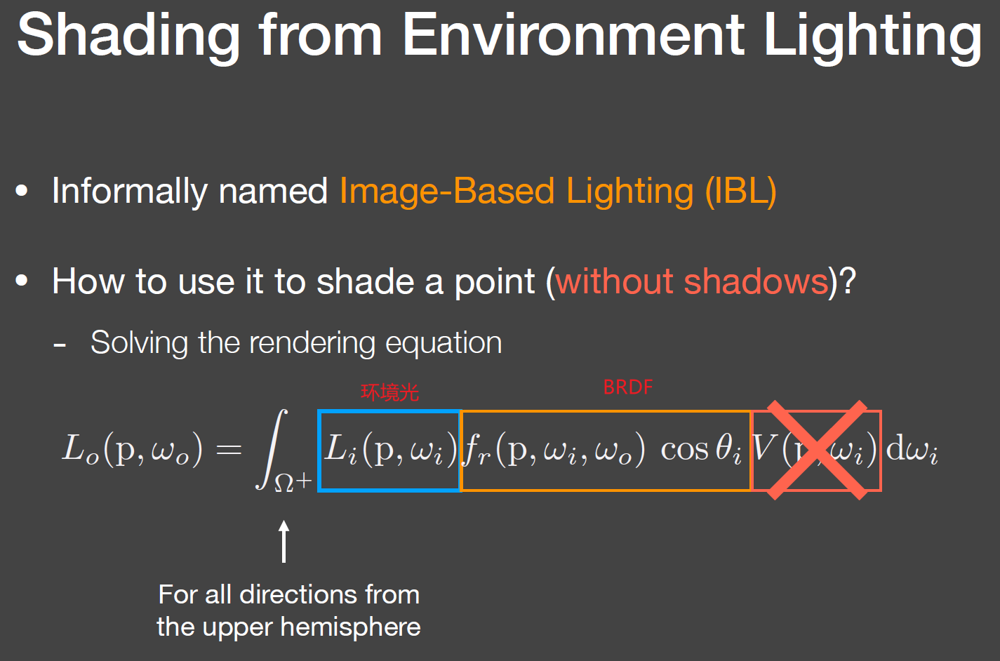

# 前言

> 《Real-Time Rendering 3rd 提炼总结》第五章纹理贴图及相关技术

作为纹理管线的第一步，投影函数的功能就是将空间中的三维点转化为纹理坐标，也就是获取表面的位置并将其投影到参数空间中。

在常规情况下，投影函数通常在美术建模阶段使用，并将投影结果存储于顶点数据中。也就是说，在软件开发过程中，我们一般不会去用投影函数去计算得到投影结果，而是直接使用在美术建模过程中，已经存储在模型顶点数据中的投影结果。但有一些特殊情况，例如：

1、OpenGL的glTexGen函数提供了一些不同的投影函数，包括球形函数和平面函数。利用空闲时间可以让图形加速器来执行投影过程，而这样做的优点是不需要将纹理坐标送往图形加速器，从而可以节省带宽。

2、更一般的情况， 可以在顶点或者像素着色器中使用投影函数，这可以实现各种效果，包括一些动画和一些渲染方法（比如如环境贴图，environment mapping，有自身特定的投影函数，可以针对每个顶点或者每个像素进行计算）。

通常在建模中使用的投影函数有球形、圆柱、以及平面投影，也可以选其他一些输入作为投影函数。

# 环境光照

**环境贴图**：在场景中任意一点往四周看去可看到的光照,将其记录在一张图上这就是环境光照,或者也可以叫做**IBL(image-based lighing)**.这里我们认为看到的光照来自于无限远处,这也就是为什么用环境光照去渲染物体时会产生一种漂浮在空中的感觉,因为光照来自于无限远处.

**存储：用spherical map和cube map**来存储环境光照。

下面详述在实时渲染领域求环境光照的过程。

# 情况一：已知环境光照，不考虑遮挡，求任何物体任何一点shading值

## 问题引入

通用解法：对上面的渲染方程使用蒙特卡洛积分，缺点是需要采集大量样本，时间消耗多

**解决思路：避免采样**

## 基本思路

根据以上渲染方程，不考虑遮挡（Visibility项），只需要将BRDF与Lighting项相乘再进行半球积分即可。

### **BRDF又分为两种情况:**

1. **BRDF为glossy时**,覆盖在球面上的范围很小,也就是small support(积分域).
2. **BRDF为diffuse时**,它会覆盖整个半球的区域,但是是smooth的,也就是值的变化不大,就算加上cos也是相对平滑的.

这两种情况均满足下面的近似公式的相等条件

### **The spilt sum: 1st stage——不采样计算Lighting**

将渲染方程中的lighting项拆出，同样对于Visibility项也可以这样拆出：

上图的橙色区域含义：将brdf范围内的lighting积分起来并进行normalize，**等价于将IBL这张图给模糊**了，**等价于在任何一点上取周围一片范围求出范围内的平均值并将平均值写回这个点上**

**Pre-filtering：在rendering之前**把滤波环境光生成，提前将不同卷积核的滤波核的环境光生成一系列模糊过的图（和mipmap相似），当我们需要时进行查询即可,其他尺寸的图则可以经过这些已生成的通过三线性插值得到。

接着在BRDF部分求shading point值，需要以一定立体角的范围内进行采样再加权平均从而求出shading point的值，而有了**Pre-filtering后的环境光之后，就可以等价于从镜面反射方向望去在pre-filtering的图上的一点进行查询，因此省去了采样的操作。**

### **The spilt sum: 2nd stage——不采样计算BRDF**

回到渲染方程的另一个部分——BRDF，如果使用预计算的方法，需要将参数的所有可能性均考虑进去,但是比较多，包括roughness、color等。考虑所有参数的话我们需要打印出一张五维或者更高的表格,这样会拥有爆炸的存储量,因此我们需要想办法降低维度,也就是减少参数量从而实现预计算.

上图回顾了微表面模型的BRDF，由于此时暂时不考虑阴影，此处需要关注的是Fresnel term和distribution of normals。

**处理过程**

- Fresnel term：利用Schlick的近似方法可以近似成一个参数为**基础反射率R0**和**入射角度**的指数函数
    
    
    
- distribution of normals：是一个一维的分布，其中有两个变量，一个变量粗糙程度定义是diffuse还是gloosy，另一个 是half vector和法线的夹角$\theta_h$，可以近似成入射角度相关的数
    
    
    
- 至此我们有了三个变量:基础反射率r0,roughness α 和角度 θ ,三维的预计算仍然是一个存储量爆炸的结果,因此我们还要想办法减少参数量.(PS:在这里我们认为反射角,入射角,half vector可以用一个角 θ 代替).于是将Schlick近似代入后半部分积分，基础反射R0被拆出积分式，需要预计算的两个量就只有roughness α 和角度 θ
    
    
    
- 可以将预计算结果绘制成一张纹理，在使用时进行查询即可。
    
    
    

另外补充一点工业界对于积分的做法：将积分写成求和，这也是在UE引擎里面所使用的环境光技术

# 情况二：已知环境光照，考虑遮挡，求任何物体任何一点shading值（带阴影）

## 问题分析

严格意义上来讲,这是不可能完成的事,因为以目前的技术来说是很难实现的,要从两个考虑角度来说:

1. **many light问题**：我们把环境光理解为很多个小的光源,这种情况下去生成阴影的话,需要在每个小光源下生成shadow map,因此会生成线性于光源数量的shadow map,这是十分高昂的代价。
2. **sampling问题**：在任何一个Shading point上已知来自正半球方向的光照去解rendering equation,最简单的方法是采样空间中各方向上的不同光照,可以做重要性采样,虽然做了重要性采样但仍需要大量的样本,因为最困难的是visibility term。由于Shading point不同方向上的遮挡是不相同的,我们可以对环境光照进行重要性采样,但一个Shading point周围的visibility项是未知的,因此我们只能盲目的去采样，无法提取出visibility项。因为如果是glossy brdf，他是一个高频的，Lighting项的积分域是整个半球,因此并不满足smooth或small support，因此无法利用近似公式来提取出visibility项.
- 在工业界：通常以环境光中最亮的那个作为主要光源,也就是太阳,只生成太阳为光源的shadow。
- 学术界
    - Imperfect shadow maps：做的是全局光照部分产生的shadow
    - Light cuts：解决的是离线渲染中的many lights的问题,核心思想是把反射物当成小光源,把所有的小光源做一下归类并近似出照射的结果
    - RTRT (might be the ultimate solution)：Real Time Ray Tracing,可能是最终解决方案
    - **Precomputed radiance transfer：PRT，可以十分准确的得到来自环境光中的阴影**

接下来就使用**PRT**的方法来求环境光照下考虑阴影的shading值，**其主要思想是**：

- PRT 通过一种预计算方法，该方法在离线渲染的 Path Tracing 工具链中预计算 lighting 以及 light transport 并将它们用球谐函数拟合后储存，这样就将时间开销转移到了离线中。
- 最后通过使用这些预计算好的数据，我们可以轻松达到实时渲染严苛的时间要求，同时渲染结果可以呈现出全局光照的效果。

## 数学基础

**基函数**：把一个函数可以描绘成其他函数的线性组合,如$f(x)$可以描绘成一系列的$Bi$函数乘以各自对应的系数最终再相加在一起,这一系列的函数$Bi$就是基函数.

****Spherical Harmonics(球谐函数)：SH是一系列基函数,系列中的每个函数都是2维函数,并且每个二维函数都是定义在球面上的。下图是SH的可视化**：**

与一维的傅里叶一样,SH也存在不同频率的函数，但不同频率的函数个数也不同,频率越高所含有的基函数越多。

其中，$l$表示的是阶数，通常第$l$阶有$2l+1$个基函数，前$n$阶有$n^2$个基函数，$m$表示的是在某一个频率下基函数的序号，分别从从$-l$到$l$。每个基函数都有一个比较复杂的数学表示，对应一个legendre多项式，我们不用去了解legendre多项式,我们只需要知道基函数长这样,可以被某些数学公式来定义不同方向的值是多少就可以了.

**投影**：由于一个函数 $f(w)$ 可以由一系列基函数和系数的线性组合表示，那么怎么确定基函数前面的系数，这就需要通过投影操作：

$f(w)$通过对应的基函数$B(i)$进行投影操作,从而求出各基函数对应的系数$Ci$。

如何理解投影：在空间中想描述一个向量，可以xyz三个坐标来表达，把xyz轴当做三个基函数，把向量投影到xyz轴上，得到三个系数就是三个坐标。

**重建**：知道基函数对应的系数，就能用系数和基函数恢复原来的函数。

由于基函数的阶可以是无限个的，越高的阶可恢复的细节就越好,但一方面是因为更多的系数会带来更大的存储压力、计算压力，而**一般描述变化比较平滑的环境漫反射部分，用3阶SH就足够。**

## PRT过程

在实时渲染中,考虑阴影的情况下我们把rendering equation写成由三部分组成的积分:

如果不进行预计算，就是遍历每个像素去解这个方程，假设环境光是6∗64∗64的map，对于每个shading point来说，计算shading需要计算6∗64∗64次。

而利用SH就可以将一些内容预计算，以节省时间开销，基本思想是：将rendering equation分为两部分,lighting 和 light transport。

- **lighting**：假设在渲染时场景中只有lighting项会发生变化(旋转,更换光照等),由于lighting是一个球面函数,因此可以用基函数来表示,在预计算阶段计算出lighting.
- **light transport(visibility和brdf)**：相当于对任一shading point来说,light transport项固定的,可以认为是shading point自己的性质,light transport总体来说还是一个球面函数,因此也可以写成基函数形式,是可以预计算出的.

### Diffuse PRT计算

**第一种理解方式**：

- BRDF几乎为常数，可以提取到积分之外
- Lighting项写为基函数形式（黄色部分），每个基函数前的系数（Lighting投影到某个基函数）为常数，可以提取到积分之外，这里的 $i$ 是入射方向
    
    
    
- 积分中只剩下基函数和visibility项，相乘之后得到的也是常数，相当于visibility项投影到基函数得到常数系数，最终的效果是把visibility项分解成了多个常数项（组成向量$T_i$）
    
    
    
- 最终计算任何一个shading point，只需要计算光照系数和visibility系数分别相乘，相当于两个向量点乘
    
    
    

**第二种理解方式**：

- 将Lighting与light transport独立开来，分别投影到各自的SH基函数上，也就是说两者使用了两套SH，分开投影。
    
    
    
- 结果得到了**Lighting与light transport各自的基函数系数*各自的基函数相乘的积分， 只有p和q下标相等的基函数相乘为1，其余为0（SH的正交性），与第一种理解方式是一样的结果。**

**PRT方法的主要限制**

- **光源**：预计算的光源我们把它投影到SH上，如果旋转，可以通过SH的旋转不变性解决，但是不能计算随机动态场景的全局光照
- **场景**：light transport做了预计算,因此visibility相当于常量,因此场景不能动,因此只能对静止物体进行计算.

### Glossy PRT计算

Diffuse和glossy的区别：

- **diffuse的brdf是一个常数，**而**glossy的brdf是一个4维的brdf**(2维的输入方向，2维的输出方向，而**SH中所表示的i或者o表示二维的输入方向或者二维的输出方向，只是在形式上只些了一个字母作为函数的变量**)。
- 直观一点来说,glossy物体有一个很重要的性质,它是和视点有关的，不同的视角得到的shading result也是不一样的。diffuse的物体不管视角如何旋转改变,看到的Shading point的result是不会改变的,因为整个Diffuse shading和视角是无关的。

因此，在计算Glossy材质的PRT时，需要考虑视点方向，也就是光线的出射方向。

- Lighting项投影到SH上，得到一系列常数$l_i$
- 剩余的BRDF、visibility项继续投影到SH，会得到关于出射方向的函数，每个出射方向都对应了一系列常数（每个出射方向的投影结果相当于Diffuse PRT得到的$T_i$）
- **最终的BRDF、visibility项的结果会是一个矩阵（所有的入射方向到所有的出射方向的预计算结果，矩阵维度取决于SH的阶数，而不是有多少入射方向和出射方向）**

效果：

**Glossy下使用PRT产生的问题**：

- 存储巨大，四阶的SH得到16个基函数，每个点需要16阶向量与16*16的矩阵相乘。
- Diffuse情况下一般三阶SH就足够，但是当Glossy非常高频时，也就是接近镜面反射的情况的时候， PRT就没有那么好用，我们虽然可以采用更高阶的SH来描述高频信息，但是使用SH甚至远不如直接采样方便。

# 情况三：考虑多次bounce

我们可以用一系列的表达式来描述不同光线传播的路径都是一种什么类。区分材质区分为三种：

1. Diffuse
2. Specular镜面反射
3. Glossy 介于两者之间

传播路径的区分：

1. $LE$：Light直接到眼Eye
2. $LGE$：Light打到Glossy物体然后到眼Eye
3. $LGGE$：多bounce一次,就是Light先打到壶嘴,在bounce到壶身,最后到眼。(L->Glossy->Glossy->Eye)
4. $L(D|G)^*E$：Light从光源出发,打到一个物体,可能是Diffuse也可能是Glossy,*表示bounce次数,最后到达眼Eye
5. $LS(D|G)^*E$：打到Specular面上，然后聚焦到Diffuse物体上,最后被眼睛看到，也就是caustics材质

结论：

- **所有路径开始都是L最后都是E，因此我们在运用PRT时候，把L和E中间所有的东西都看作是Light transport。**
- 拆分为light和light transport之后,不管中间boucne几次,我们只需要预计算出Light transport就行，不论多么复杂的bounce,我们只需要计算出light transport就能得出最后的shading result。

**计算方式**：

理解方式1：把light transport（图上红色下划线部分）投影到SH基函数（做了一个**Product Integral）**

理解方式2：把light transport的预计算看作是基函数$B_i(i)$照亮了场景的渲染过程。换句话说，把基函数看为lighting项，那么light transport就是rendering equation，我们把light transport投影到basis上，相当于用basis这个Lighting照亮物体，每个basis得到一个渲染图，最后我们进行重建从而得出最后的shading值。而解这部分的过程依旧和解渲染方程一样。

渲染效果：

# PRT方法总结

Sloan在02年提出的这个方法（即PRT），使用球谐函数估计光照和光线传输，将光照变成光照系数，将光线传输变成系数或者矩阵的形式，通过预计算和存储光线传输将渲染问题变为每个vertex/shading point：点乘（diffuse表面）、向量矩阵乘法（glossy表面）。

由于球谐函数的性质，该方法比较适合使用于低频的情况（可用于高频但不合适,如图即使使用了26*26阶的sh仍然得不到比较好的效果）；当改变场景或者材质时需要重新预计算light transport，此外预计算的数据比较大。

基于Sloan依旧有许多后续的研究…

# 其它基函数

此外，基函数除了可以使用球谐函数外，还有很多选择，比如Wavelet、Zonal Harmonics、Spherical Gaussian、Piecewise Constant等。

## Wavelet小波函数

小波变换的过程就是投影过程，相比于球谐函数对低频内容友好（球谐函数使用少量的基去表示），小波变换可以全频率表示，但是只有很少的系数是非零的.

由于小波是平面上的函数，为了防止变换后在球面上出现缝隙，所以采用了**Cubemap**来作为环境光而不是Sphereical map。

从图中可以看到,小波变化是把每张图的高频信息留在这张图的左下,右上和右下三部分,而把剩余的低频信息放在左上角,左上角的信息可以继续进行小波变换,我们会发现高频的东西很少,对于绝大部分来说是0,不断地进行小波变换可以得到一个很不错的既保留了低频又保留了高频的压缩.

但是小波也有自己的缺陷：不支持旋转（使用球谐函数进行表示时，由于球谐函数具有**simple rotation**的性质，所以支持光源的旋转）。

# 参考

[Lecture5 Real-time Environment Mapping_哔哩哔哩_bilibili](https://www.bilibili.com/video/BV1YK4y1T7yY?p=5)

[Lecture6 Real-time Environment Mapping_哔哩哔哩_bilibili](https://www.bilibili.com/video/BV1YK4y1T7yY?p=6)

[Lecture7 Real-time GLobal Illumination (in 3D)_哔哩哔哩_bilibili](https://www.bilibili.com/video/BV1YK4y1T7yY/?p=7)

[Games202 高质量实时渲染笔记lecture 05 Real-Time Environment Mapping - 知乎 (zhihu.com)](https://zhuanlan.zhihu.com/p/371112302)

[Games202 高质量实时渲染笔记lecture 06 Real-Time Environment Mapping 02 - 知乎 (zhihu.com)](https://zhuanlan.zhihu.com/p/373697912)

[GAMES202 高质量实时渲染笔记Lecture07：Real-Time Global Illumination (In 3D) - 知乎 (zhihu.com)](https://zhuanlan.zhihu.com/p/377104538)