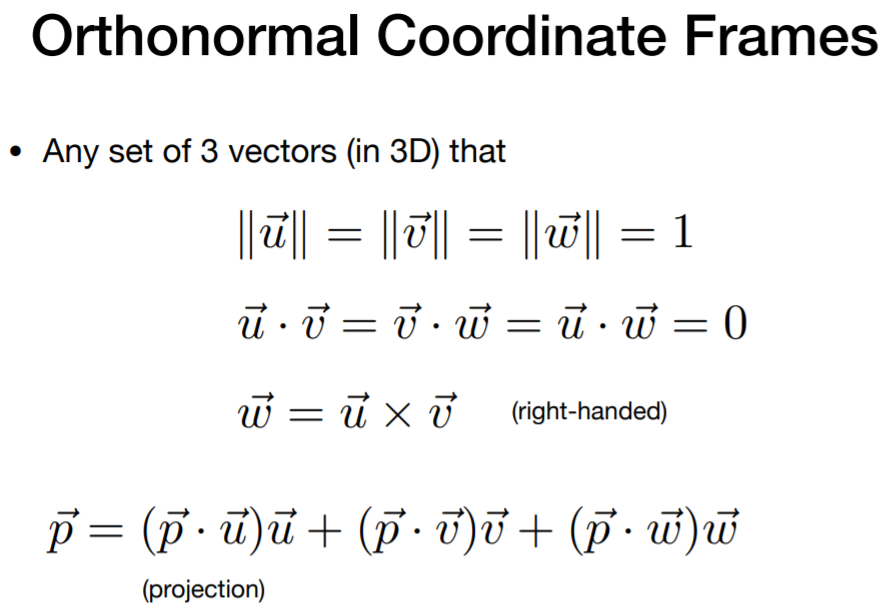
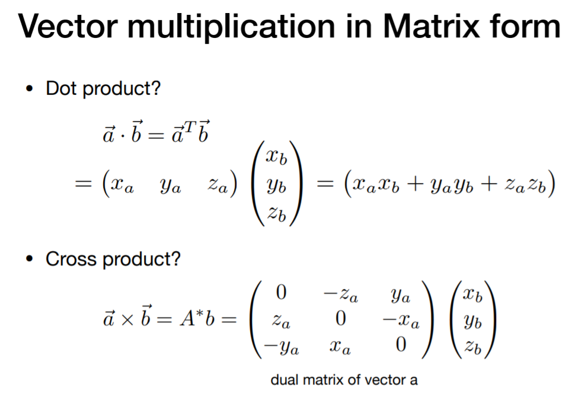

# 线性代数基础

- 叉乘计算公式

  

- 任意向量在三维坐标中的分解

  

- 向量与矩阵的联系

  

# 线性变换

- 基本概念

  - 如果 AAT=E（E 为单位矩阵，AT 表示“矩阵 A 的转置矩阵”）或 ATA=E，则 n 阶实矩阵 A 称为正交矩阵
  - 设 A 是一个 n 阶矩阵，若存在另一个 n 阶矩阵 B，使得： AB=BA=E ，则称方阵 A 可逆，并称方阵 B 是 A 的逆矩阵

- 齐次坐标的目的：将线性变换（压缩、旋转等）和非线性变换（平移）都用一个变换矩阵来表示。向量和点的区别，2 维的向量或点用 3 维的矩阵表示

  
  

- 仿射变换，又称仿射映射，是指在[几何](https://baike.baidu.com/item/%E5%87%A0%E4%BD%95/303227)中，一个[向量空间](https://baike.baidu.com/item/%E5%90%91%E9%87%8F%E7%A9%BA%E9%97%B4/5936597)进行一次[线性变换](https://baike.baidu.com/item/%E7%BA%BF%E6%80%A7%E5%8F%98%E6%8D%A2/5904192)并接上一个[平移](https://baike.baidu.com/item/%E5%B9%B3%E7%A7%BB/2376933)，变换为另一个向量空间。
- 投影变换（projection transformation）是将一种[地图投影](https://baike.baidu.com/item/%E5%9C%B0%E5%9B%BE%E6%8A%95%E5%BD%B1)点的[坐标变换](https://baike.baidu.com/item/%E5%9D%90%E6%A0%87%E5%8F%98%E6%8D%A2/5261943)为另一种地图投影点的[坐标](https://baike.baidu.com/item/%E5%9D%90%E6%A0%87/85345)的过程。研究投影点坐标变换的理论和方法。
- 表示旋转的时候，变换矩阵的逆矩阵等于变换矩阵的转置（说明该变换矩阵为正交矩阵）

  
