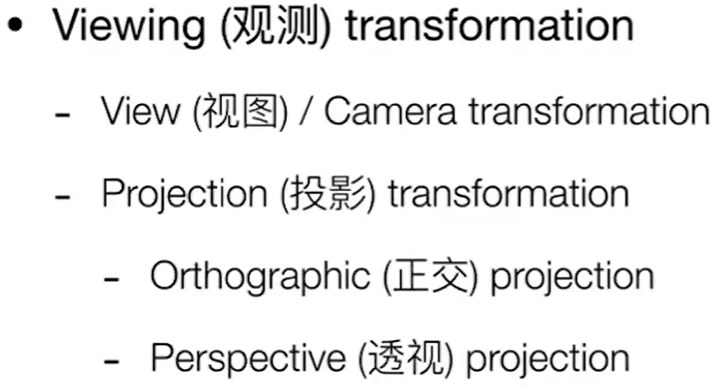
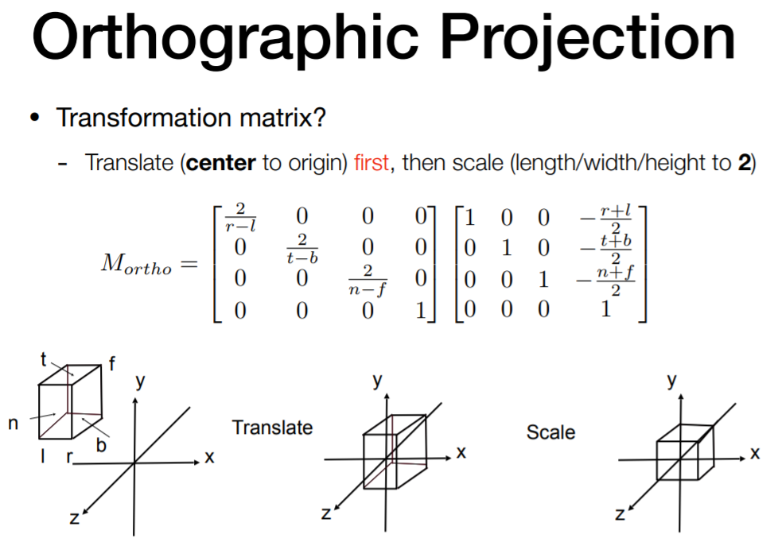
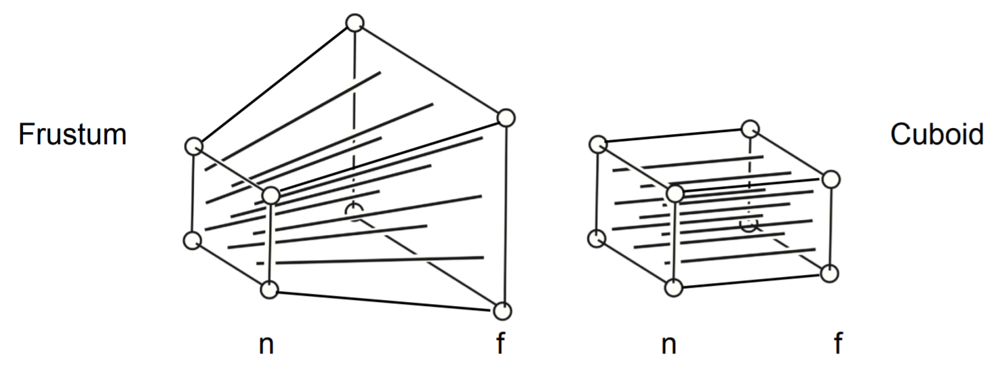
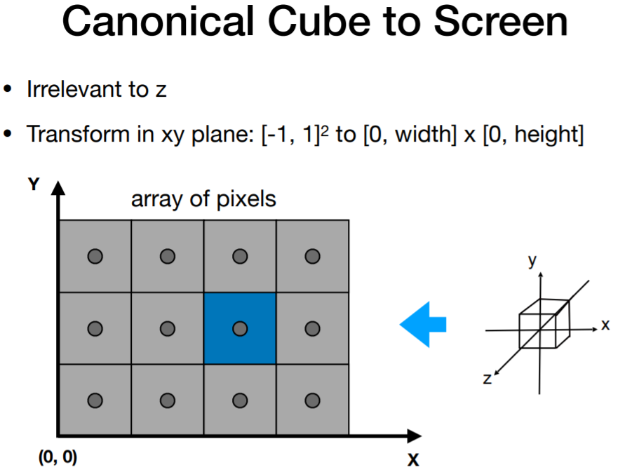

# 旋转

-   Rodrigues 旋转公式：实现某三维物体的坐标绕过原点的向量轴 n 旋转 α 角度的旋转矩阵为 R(n,α)，这是[Rodrigues 旋转公式的推导](https://dreamfields.github.io/2021/08/06/GAMES101%E9%87%8D%E8%A6%81%E5%85%AC%E5%BC%8F%E6%8E%A8%E5%AF%BC%E8%A1%A5%E5%85%85/#Rodrigues%E6%97%8B%E8%BD%AC%E5%85%AC%E5%BC%8F)

    
    

-   图形学的成像，类比拍照。

    -   第一步将模型摆好，称为模型变换；第二部将相机的位置摆好，称为视图（或相机）变换；第三步将物体投影到屏幕上，称为投影变换。

        

    -   其中，观测变换包括两部分：视图变换 \+ 投影变换

        

    -   1.视图变换

        -   摆放相机：因为我们屏幕看到的物体始终是从原点看向负 z 轴，所以这一步的任务就是——将一个任意位置、看向任意方向的相机，摆放到原点，并看向负 z 轴，即定义位置（原点）、上方向（y 方向）、看的方向（-z 方向）。该过程实际上是将世界坐标系的物体进行变换，使得从原点处向负 z 轴看变换后的该物体等于原来相机位置处看向原来物体的样子，也就是说，得到一个视图变换矩阵，让物体经过该矩阵的变换，达到屏幕显示的物体等于摄像机在原来位置处想要看到的物体的效果。进一步说，关键在于——将相机固定住，所有的移动都是物体在移动

            

        -   如何将当前相机（左）变换到规定的方向（右）

            

            -   通过一个变换矩阵，其中 T（view）为平移矩阵，R（view）为旋转矩阵。

                -   可以验证，R 逆分别对 X(1,0,0,0)、Y(0,1,0,0)、Z(0,0,1,0)进行变换后，就可以得到 g×t、t、-g
                -   如何写出 R 的逆矩阵？从右图的标准位置向左变换即可。

                    

    -   2.投影变换

        -   正交投影

            -   相机看作一个平面。将空间中的所有物体经过变换矩阵统统变换到以原点为中心的边长为 2 的立方体中，注意是先平移到原点后放缩为立方体，其变换矩阵如下：（此时物体会被放缩变形，但之后会再进行视口变换，再次对物体进行放缩还原）

                

        -   透视投影

            -   相机看作一个点。将空间中的物体所在面映射到一个固定的平面，可以看作先将远处的平面压缩为等同于固定平面大小的平面，得到上图的最左边的立方体，然后再进行正交投影得到以原点为中心的边长为 2 的立方体。

                

            -   规定：近处的平面的大小和位置永远不变；远处平面的大小会被压缩，但远近（z 值不变）；远处平面的中心点在压缩后也不变。[经过证明](https://dreamfields.github.io/2021/08/06/GAMES101%E9%87%8D%E8%A6%81%E5%85%AC%E5%BC%8F%E6%8E%A8%E5%AF%BC%E8%A1%A5%E5%85%85/)，中间的点会向远处的平面靠近。
            -   透视投影矩阵的形式见： [GAMES101 重要公式推导与算法补充](https://dreamfields.github.io/2021/08/06/GAMES101%E9%87%8D%E8%A6%81%E5%85%AC%E5%BC%8F%E6%8E%A8%E5%AF%BC%E8%A1%A5%E5%85%85/)

# 光栅化

-   光栅化是一种将几何图元变为二维图像的过程。

    -   视口变换：将经过视图和投影变换后，得到的二维平面将会是中心点在原点、边长为 2 的正方形，视口变换就是将该正方形重新拉伸为实际的长方形，并将左下角移动到原点的过程，便于将像素值存储到二维矩阵中。在 OpenGL 中，视口变换是通过 glViewport 函数来完成的。

        

    -   这个过程与 z 并不相关，注意是先放缩为矩形后平移，其变换矩阵如下：

        
