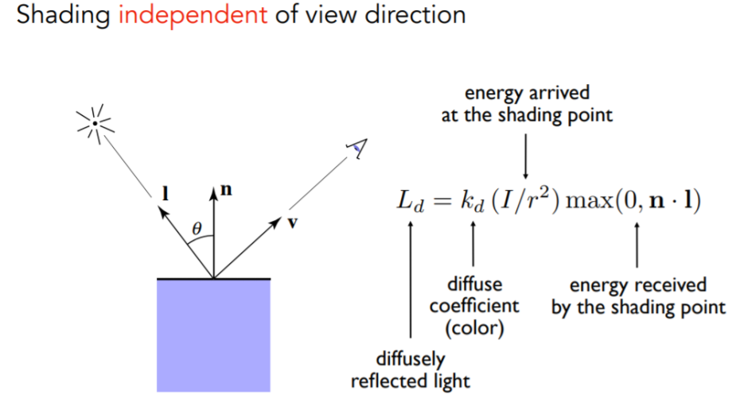
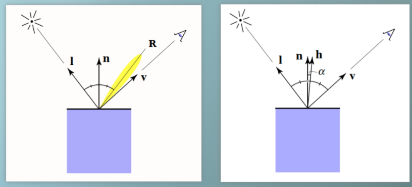
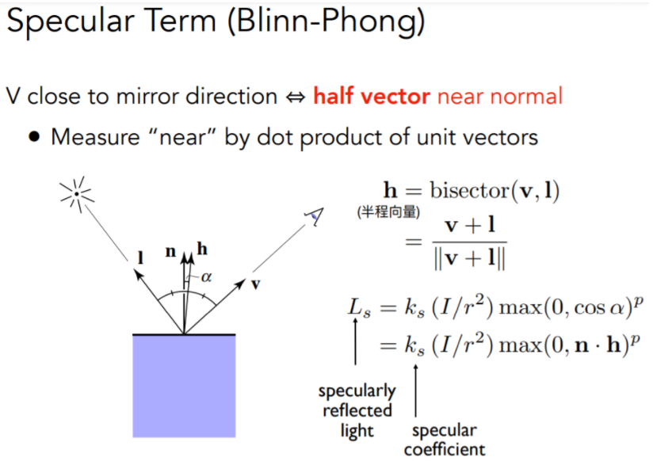
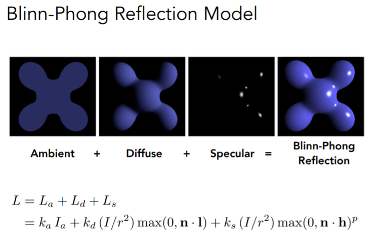
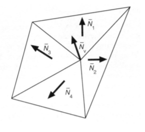

# [深度缓冲与着色](https://sites.cs.ucsb.edu/~lingqi/teaching/resources/GAMES101_Lecture_07.pdf)

- 思路与算法：在绘制最终的图像同时，绘制深度图，记录每个像素距离相机最近的深度值

  
  
   

# 着色 Shading：对不同的物体应用不同的材质的过程（不同的材质就是不同的着色方法）

- 漫反射

  - 漫反射与人眼位置无关，从各个方向看上去亮度均相同，公式中也可以反映出来。

     

  - 其中，Kd 表示漫反射系数，0 为完全不反射，1 为镜面反射。可以使用一个颜色向量值来表示该点反射出的光线的颜色

- [高光](https://sites.cs.ucsb.edu/~lingqi/teaching/resources/GAMES101_Lecture_08.pdf)

  - 当眼睛的方向和镜面反射光线的方向较为接近时可以看到，即下图的 R 与 v 接近
  - Blinn-Phong 模型：将“R 与 v 接近”转换为“半程向量 h 与法向量 n 接近”
       
      

  - 上图的指数 p 表示高光系数，原因：余弦函数对角度的容忍度较高，而期望的效果是高光集中在很小的范围内，因此对其进行指数操作。p 一般取 100~200。

      

- 环境光

  - 来自四面八方的反射光线，极为复杂，因此假设（简化后）：环境光来自所有方向，且强度相同，颜色相同。与实际光线方向和眼睛的方向无关，设为一个常数。实际上要计算真实环境光需要用到全局光照的部分。

- Blinn-Phong 反射模型

  

- 着色频率

  - 通俗理解：将着色应用到哪些点上
  - 着色频率的分类

    - Flat shading（对每个三角形求一个法向量，对应只有一个颜色，对光滑表面效果较差）
    - Gouraud shading（对每个顶点求法向量，三角形内部利用插值进行着色）。顶点的法向量，可以对其相邻接的三角形的各个法向量求加权平均，权重可以设置为该三角形的面积。

      

    - Phong shading（对每个三角形，得到三个顶点的法向量，从而插值出三角形内部每个像素的法向量，然后对每个像素进行一次着色）

  - 当顶点足够多、模型足够复杂时，就可以使用比较简单的着色频率，效果可以接收。

    
