# [深度缓冲与着色](https://sites.cs.ucsb.edu/~lingqi/teaching/resources/GAMES101_Lecture_07.pdf)

-   思路与算法：在绘制最终的图像同时，绘制深度图，记录每个像素距离相机最近的深度值

    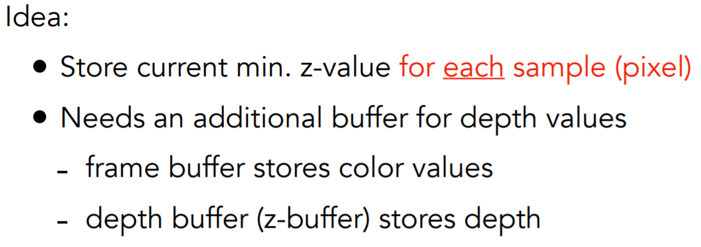
    

# 着色 Shading

-   **对不同的物体应用不同的材质的过程（不同的材质就是不同的着色方法）**

### 漫反射

-   漫反射与人眼位置无关，从各个方向看上去亮度均相同，公式中也可以反映出来。

    

-   其中，Kd 表示漫反射系数，0 为完全不反射，1 为镜面反射。可以使用一个颜色向量值来表示该点反射出的光线的颜色

### [高光](https://sites.cs.ucsb.edu/~lingqi/teaching/resources/GAMES101_Lecture_08.pdf)

-   当眼睛的方向和镜面反射光线的方向较为接近时可以看到，即下图的 R 与 v 接近
-   Blinn-Phong 模型：将“R 与 v 接近”转换为“半程向量 h 与法向量 n 接近”
      
    

-   上图的指数 p 表示高光系数，原因：余弦函数对角度的容忍度较高，而期望的效果是高光集中在很小的范围内，因此对其进行指数操作。p 一般取 100~200。

    

###环境光

-   来自四面八方的反射光线，极为复杂，因此假设（简化后）：环境光来自所有方向，且强度相同，颜色相同。与实际光线方向和眼睛的方向无关，设为一个常数。实际上要计算真实环境光需要用到全局光照的部分。

### Blinn-Phong 反射模型

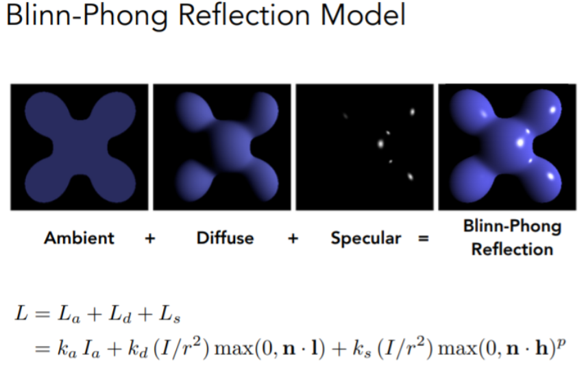

### 着色频率

-   通俗理解：将着色应用到哪些点上
-   着色频率的分类

    -   Flat shading（对每个三角形求一个法向量，对应只有一个颜色，对光滑表面效果较差）
    -   Gouraud shading（对每个顶点求法向量，三角形内部利用插值进行着色）。顶点的法向量，可以对其相邻接的三角形的各个法向量求加权平均，权重可以设置为该三角形的面积。
        

    -   Phong shading（对每个三角形，得到三个顶点的法向量，从而插值出三角形内部每个像素的法向量，然后对每个像素进行一次着色）

-   当顶点足够多、模型足够复杂时，就可以使用比较简单的着色频率，效果可以接收。

    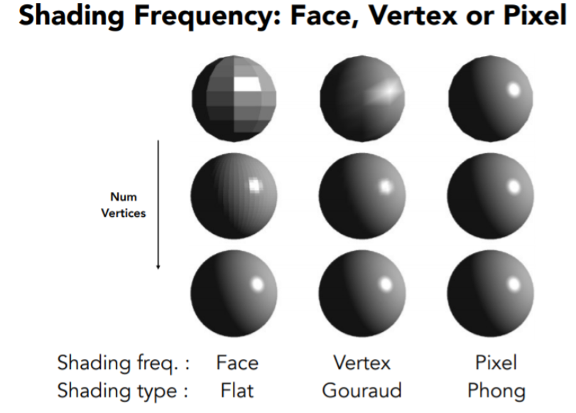

# 图形管线（实时渲染管线）

-   通俗理解：从场景到一张图片所经历的整个过程的不同操作
-   OpenGL 中的 Fragment（片段）可以理解为像素。该过程已经在硬件中写好，即 GPU 的渲染过程。

    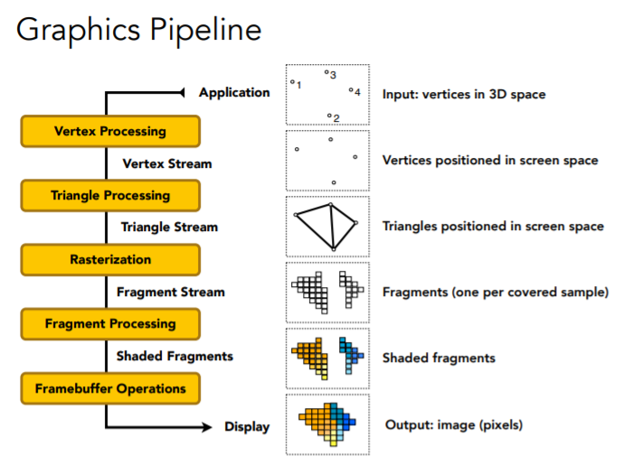

    -   顶点处理的作用是指对所有的顶点数据进行 Model，View，和 Projection 的变换，最终得到投影到二维平面的坐标信息(同时为了 Zbuffer 保留深度 z 值)。当然如果超出观察空间的会被剪裁掉。
    -   三角形处理就是将所有的顶点按照原几何信息，变成三角面，每个面由 3 个顶点组成。得到了许许多多个三角形之后，接下来的操作自然就是三角形光栅化。
    -   在进行完三角形的光栅化之后，知道了哪些在三角形内的点可以被显示，那么如何确定每个像素点或者说片元(Fragement)的颜色呢？\[注：片元可能比像素更小，如 MSAA 抗拒齿操作的进一步细分得到的采样点\]。那自然就是着色了，也就是片元处理阶段应该做的。
    -   着色部分在顶点和像素处理过程都可能发生，关键看着色频率的方法。如果是 Gouraud shading，仅在顶点进行着色；如果是 Phong shading，则会在像素生成之后进行着色。因此，着色的关键在于——顶点或者像素（片段）如何着色，该部分的程序即为着色器（定义了一个顶点或者像素该执行什么操作，且只执行一次）。在现代的 GPU 中，该套渲染管线允许某些部分是可编程的。

        

    -   Framebuffer 的操作，就是将所有的像素颜色信息整合在一起，输送给显示设备加以显示。

# 纹理

## 规定

-   假设三维物体中的坐标可以映射到二维纹理图片的坐标（参数化）
-   对于二维的纹理图片（不考虑像素和长宽），其 u、v 均在（0，1）范围内

## 重心坐标

-   针对顶点的任意属性（如纹理坐标、颜色、法向量、深度等）做三角形内部的插值

-   重心坐标定义在一个三角形中，如果某个点在三角形内部，这三个值（α、β、γ）均为非负，且和为 1。三个值（α、β、γ）可以用面积求得，也可以利用三个顶点的坐标公式求得。

    
    
- 详细的推导： [直线与三角形的重心坐标（Barycentric Coordinates）的推导与应用](https://zhuanlan.zhihu.com/p/361943207)

-   插值应该在三维物体投影到二维平面之前做，因为重心坐标不能保证投影后插值得到的属性值不变。如果插值在投影到二维平面之后做，就需要进行一个矫正操作——[透视矫正插值](https://zhuanlan.zhihu.com/p/144331875)。

## 存在的问题

-   如果屏幕分辨率很大（如 4k），而纹理图片分辨率很小（如 256\*256），那么会出现：屏幕与纹理图片上的点并不能一一对应，得到的是非整数的纹理坐标。解决方法：

    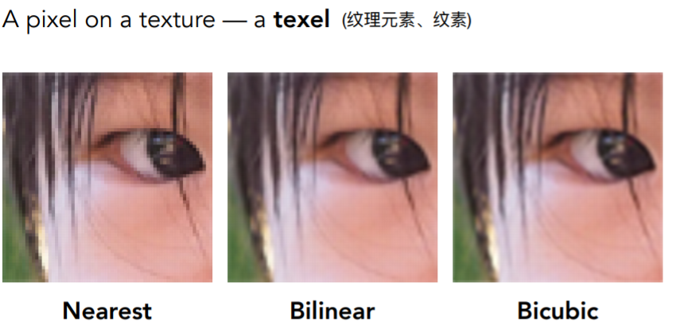

    -   Nearest：取整，相当于屏幕的多个点（像素）对应了纹理图片的一个像素
    -   Bilinear：双线性插值。红点的来源：三维物体中三角面片内部的某一点，经过插值得到一个点，再经过投影变换到屏幕上，再经过映射得到纹理坐标，即该红点。双线性插值经历了两次水平方向的插值，一次竖直方向的插值，最终得到一个平滑的纹理的像素值。

        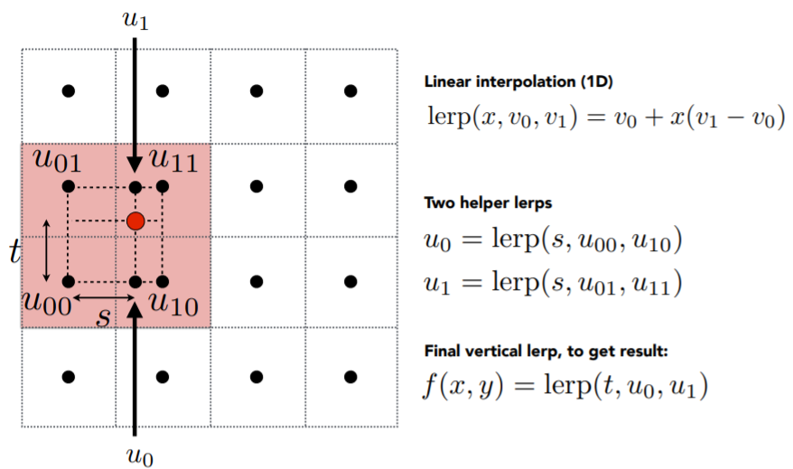

    -   Bicubic：双三次插值，对周围的 16 个纹理坐标进行插值得到像素值。

-   相反，如果屏幕分辨率很小，而纹理图片分辨率很大，那么会出现一个屏幕像素点对应了多个纹理像素点，即覆盖了大块的包含图案变化的纹理区域，便出现走样（屏幕的采样频率跟不上纹理的变化频率）。解决方法：

    -   超采样：一个屏幕像素点分为多个采样点来对应纹理坐标，最后取平均值（有效果，开销过大）
    -   Mipmap 多级渐远纹理（利用范围查询的知识：给一个区域，立刻能够知道该区域内部纹理像素的平均值），只能做近似的正方形的范围查询。在渲染之前，提前计算纹理图的渐远纹理，存储空间仅为原图的 4/3。

        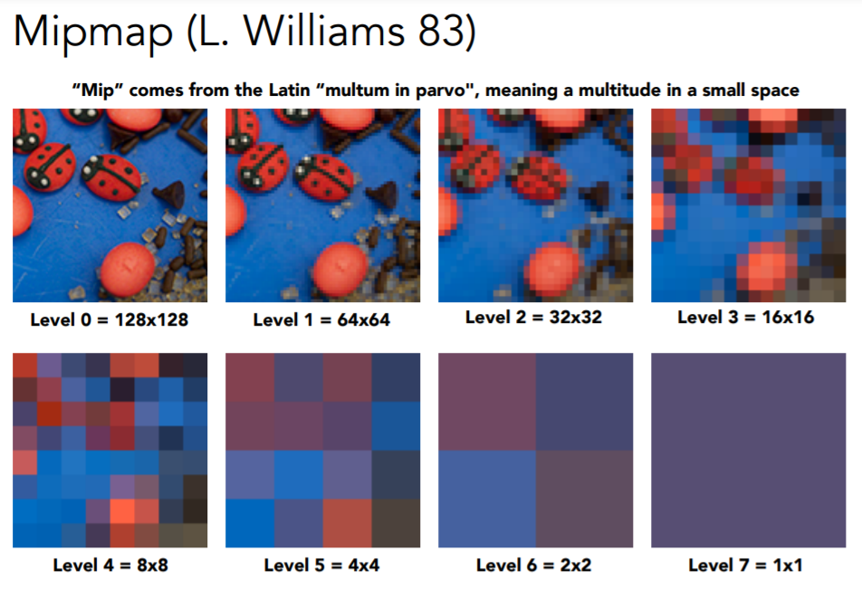

        -   关键：计算某个屏幕像素应该映射到哪个 level（记为 D）的纹理上。将一个屏幕像素的临近点映射到 level 0 的纹理图上，估计该像素覆盖的一个正方形的边长 L，求以 2 为底的对数即可得到 D。如果 L=1，即一个屏幕像素对应 1 个原始纹理像素，利用原始纹理图即可，D=0；如果 L=4，即一个屏幕像素对应 4\*4 个原始纹理像素，那么利用 D=2 的纹理图即可得到对应的 1 个纹理像素。

            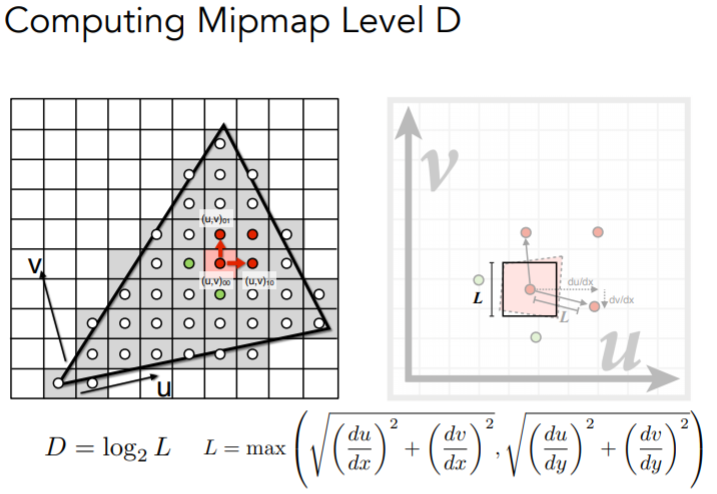

        -   问题 1：如果 L 不是 2 的指数，可以对 D 取整，但很有可能得到的纹理映射结果出现断层。此时利用三线性（Trilinear）插值即可——L=3 时，分别计算 D=1 和 D=2 的双线性插值结果后，再计算两个结果的线性插值。

            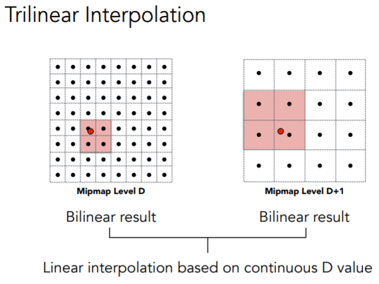

        -   问题 2：过度模糊（Overblur）问题，在远处无法得到清晰的纹理映射。原因在于，屏幕上的一个像素映射到纹理坐标，可能覆盖了多个纹理像素，此时查询多级渐远纹理后只对应了一个平均的纹理像素值，就产生了模糊。

            

            -   解决方法

                -   各向异性过滤（Anisotropic Filtering，或 Ripmap），将纹理像素的长和宽分别压缩与同时压缩，耗费了原始纹理像素的 3 倍存储空间，那么对于上图右侧的矩形即可准确得到纹理映射。缺点在于：对于上图左侧的倾斜矩形，无法得到正确的结果。

                    

                -   EWA 过滤，把一个覆盖到纹理像素的不规则形状拆分为多个圆形，执行多级查询，耗费时间，但效果较好。

                    

## 纹理应用技术

-   现代计算机 GPU 中，可以把纹理理解为一块内存，以及可以在这块内存中进行范围查询，即 texture = memory + range query (filtering)
-   环境映射（Environment Mapping）。为了实现接受环境光的效果，我们可以用一个贴图来存放环境光信息，即 环境贴图（Environment Map） 或 反射贴图（Reflection Map），在给物体着色的时候不仅采样普通纹理，也采样环境贴图，按一定比例混合这两者的颜色（例如物体材质越光滑，镜面反射效果越强）。即用纹理描述环境光的样子，从而用该纹理去渲染物体。

    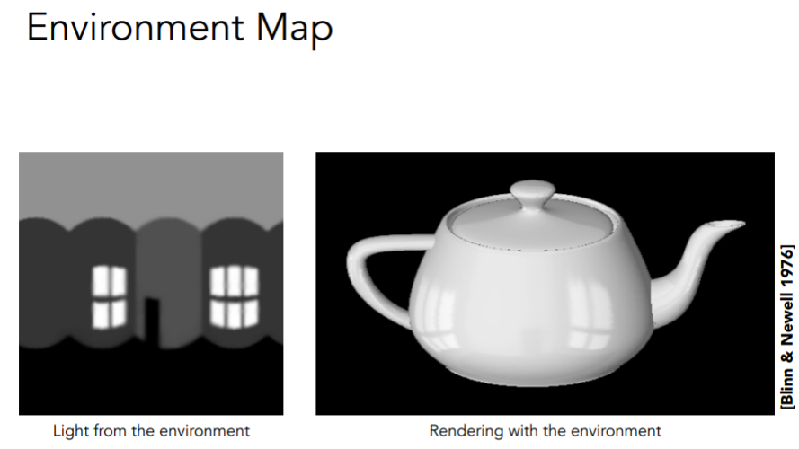

-   球面环境贴图（Spherical Environment Map）。把环境光记录到球面上，并展开，但会出现扭曲现象。

    

-   解决球面环境贴图扭曲现象的办法——立方体贴图（Cube Map）。设置一个包围盒，将球面上的点延长交于包围盒，并展开。

    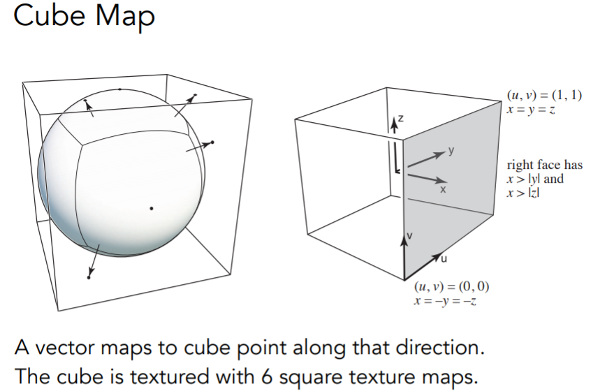

-   凹凸贴图（Bump Mapping）。通过改变表面各点的相对高度，使本来是平的东西看起来有凹凸的效果，是一种欺骗眼睛的技术（因为物体结构并没有发生改变）。例如这个球看起来凹凸不平，实际它的几何结构就是光滑的球，只是通过凹凸贴图改变了各像素点的法线方向，从而导致光照结果不一，产生出凹凸不平的视觉效果。即不把几何形体变复杂的情况下，可以通过应用复杂的纹理定义相对高度，从而法线会发生变化。

    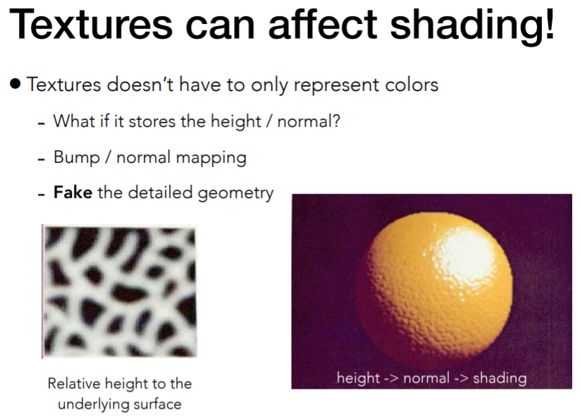

    -   首先，凹凸贴图是在不增加三角面片的情况下增加表面细节来实现的。黑色的线是真实的表面，黄色的线是通过凹凸贴图定义的，那么其法向量原本是 p，改变为 n

        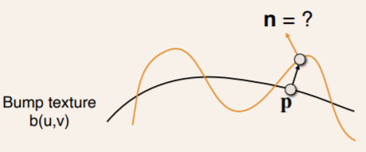

    -   下图展示的是二维情况下的法向量改变的过程：先假设某一点 p 的局部法向量 n（p），计算该点处在凹凸贴图上的切线，求其垂直向量。之后推广到三维情况即可，需要注意的是：真实模型中某一点 p 的法向量不一定是朝向 z 的，但假设在该局部是这样，计算好改变后的法向量后需要通过变换才能得到真实的改变了的法向量。

        
        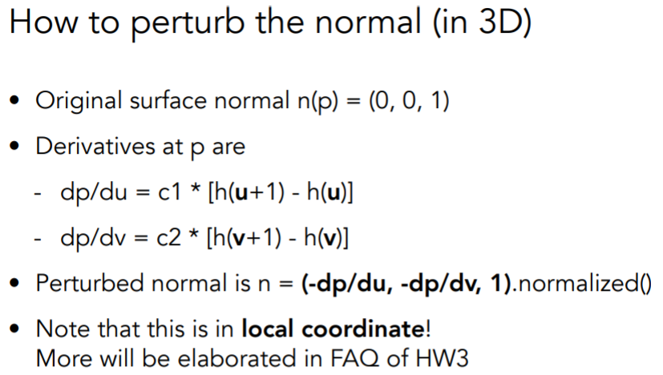

-   位移贴图（Displacement mapping），需要三角形足够细致，否则还会出现走样问题。但在 DirectX 中可以根据需要将三角形进行细分，从而避免该问题。

    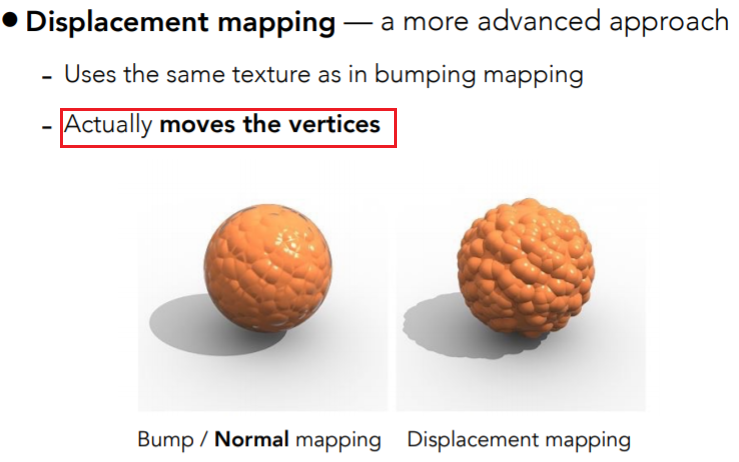

-   除此之外，还有三维纹理、环境光遮蔽、医学体渲染等纹理应用。可以参考：[纹理映射技术](https://www.cnblogs.com/KillerAery/p/15106770.html#%E7%BA%B9%E7%90%86%E5%BA%94%E7%94%A8%E6%8A%80%E6%9C%AF%EF%BC%88texture-application%EF%BC%89)

# 阴影

-   这里考虑点光源产生的阴影，只有两种情况：在阴影中和不在阴影中（硬阴影）。如果是软阴影，则光源一定有大小。
-   **关键——人眼和光源能够同时看到该点，就不在阴影中。**
-   step1：假设光源前有一个屏幕，从光源看场景，记录每个点到光源屏幕的深度，得到一张深度图
-   step2：从人眼（相机）看物体的每个点，再投影到光源处，计算该点到光源的深度，如果等于 step1 中计算的深度，就表示不在阴影中。
