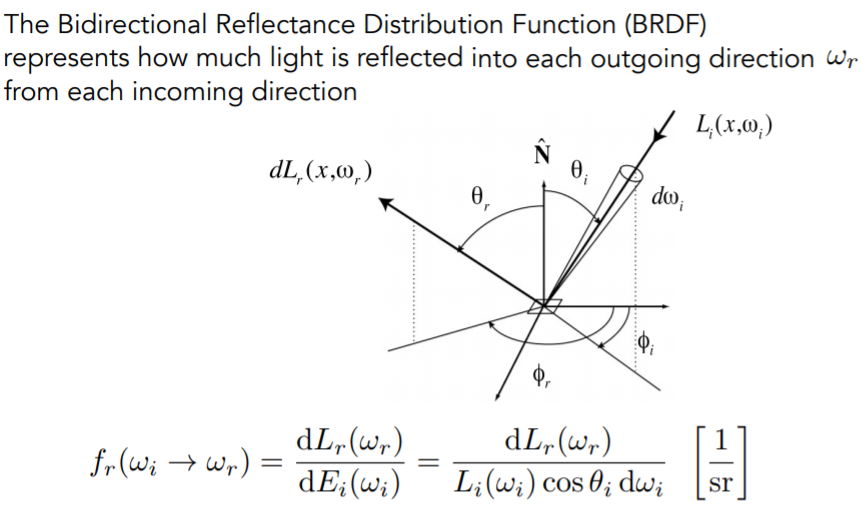
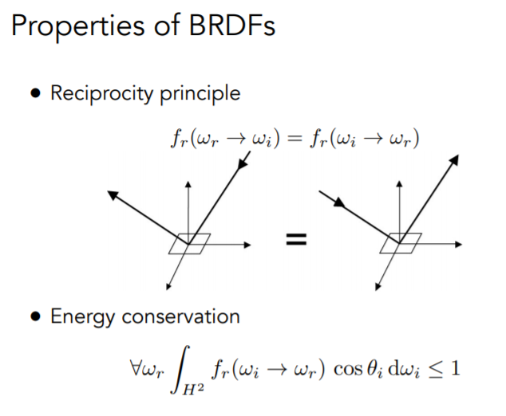
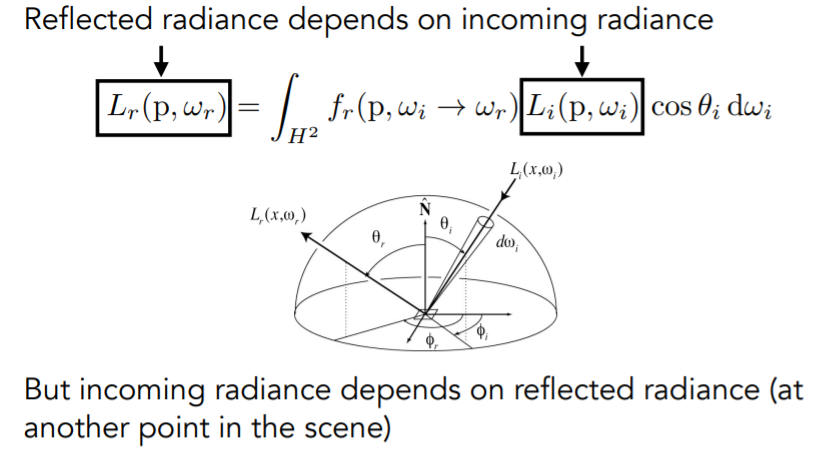
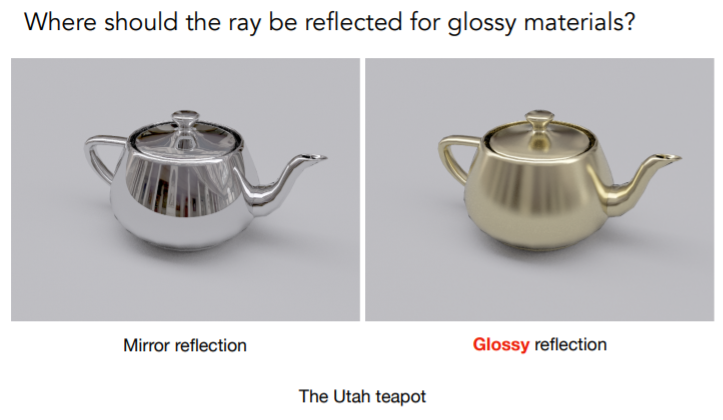

# [基础知识](https://sites.cs.ucsb.edu/~lingqi/teaching/resources/GAMES101_Lecture_14.pdf)（[参考文章](https://blog.csdn.net/qq_38065509/article/details/106496354)）

### 基本概念

  - 辐射强度(Radiant intensity)

    - 从光源发出的每单位立体角上的 power（这里的 power 指单位时间的能量，相当于辐射功率，可以理解为亮度）。其大小不会随着 r 的增加而衰减，因为 r 变大的同时，立体角不变，辐射面积会以 r 平方的比例增加。

      

  - irradiance

    - 指每单位照射面积所接收到的(入射的）power

      

  - radiance

    - 发射的、反射的、折射的、接收的光线在每单位立体角、每单位垂直面积上的 power，同时指定了光的方向与照射到的表面所接受到的亮度。

      

  - 辨析

    - 由公式可以看出，radiance 可认为是：每单位立体角上的 irradiance；每单位投影面积上的 intensity。
    - radiance 可以分为入射的和出射的

      - 入射 radiance：每单位立体角上的接收的 irradiance

        

      - 出射 radiance：每单位投影面积发射的 intensity

        

    - 讨论比较重要的 radiance 和 irradiance 的关联

      - 整理

        

      - E ( p ) 就是点 p 的 irradiance，其物理含义是点 p 上每单位照射面积的 power，而 L (p,ω)指入射光每立体角，每垂直面积的 power。因此积分式子右边的 cosθ 解释了面积上定义的差异，而对 dω 积分，则是相当于对所有不同角度的入射光线做一个求和（这里的 H 平方是指的点 p 对应的整个半球面方向），那么该积分式子的物理含义便是：一个点(微分面积元)所接收到的亮度（irradiance)，由所有不同方向的入射光线亮度(radiance)共同贡献得到。

### BRDF

  - 参考文章：[基于物理着色：BRDF](https://zhuanlan.zhihu.com/p/21376124)
  - 光线反射的理解角度：一个点(微分面积元)在接受到一定方向上的亮度(dE(ωi ))之后，再向不同方向把能量辐射出去(dLr(ωr))。
  - Bidirectional Reflectance Distribution Function 双向反射分布函数，定义了从单位面积上，吸收了某个方向的入射光线后，向某个方向射出的光线的比例。

    

  - 不同物体表面材质自然会把一定方向上的入射亮度反射到不同的方向的光线上，如理想光滑表面会把入射光线完全反射到镜面反射方向，其它方向则完全没有。如理想粗糙表面会把入射光线均匀的反射到所有方向。因此所谓 BRDF 就是描述这样一个从不同方向入射之后，反射光线分布情况的函数。
  - 性质

    - 非负性。线性：表面上某一点的全部反射辐射度可以简单地表示为各 BRDF 反射辐射度之和。

      

    - 可逆性：交换入射光和反射光的角色，并不会改变 BRDF 的值。能量守恒：入射光的能量与出射光的总能量应该相等。

      

    - 各向同性与各向异性。如果是前者，其结果只与相对的方位角有关

      

  - Measuring BRDFs

### 渲染方程

  - 由 BRDF 得到反射方程，描述的含义是：某个方向的反射光线，取决于从该点对应的半球面的所有方向（立体角）吸收的亮度 radiance。

    

  - 当然实际情况中可能不会考虑整个半球面方向的入射光线，如只有若干个点光源或面光源，则只把光源进行求和或积分（此时暂时不考虑非光源的光线，如其他反射光等）即可。

# [蒙特卡洛路径追踪](https://sites.cs.ucsb.edu/~lingqi/teaching/resources/GAMES101_Lecture_16.pdf)（[参考文章](https://blog.csdn.net/qq_38065509/article/details/106619170)）

- [蒙特卡洛积分推导和性质](https://www.zhihu.com/topic/19675767/hot)
- (Whitted-Style) 光线追踪的问题

  - 1.在磨砂材质上的表现不应该像镜面反射一样

    

  - 2.对于漫反射材质之间并反射光线，左图是直接光照，右图是全局光照。

    

- [蒙特卡洛路径追踪算法](https://dreamfields.github.io/2021/08/06/GAMES101%E9%87%8D%E8%A6%81%E5%85%AC%E5%BC%8F%E6%8E%A8%E5%AF%BC%E8%A1%A5%E5%85%85/#%E8%92%99%E7%89%B9%E5%8D%A1%E6%B4%9B%E8%B7%AF%E5%BE%84%E8%BF%BD%E8%B8%AA%E7%AE%97%E6%B3%95)
