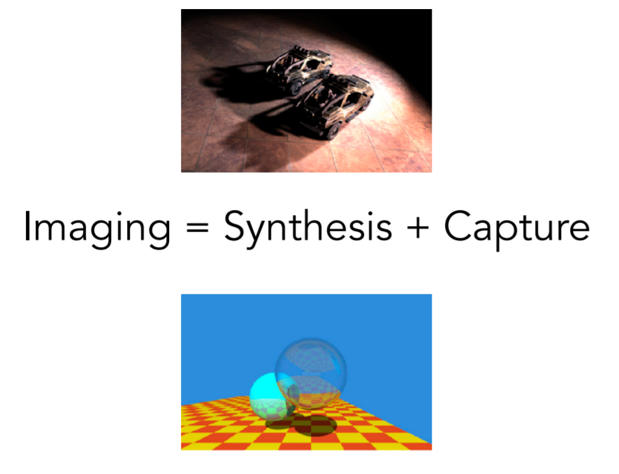
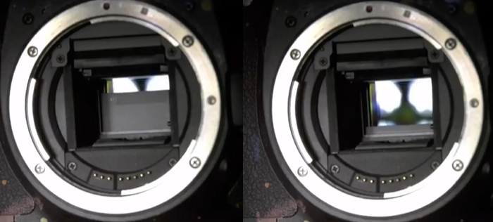
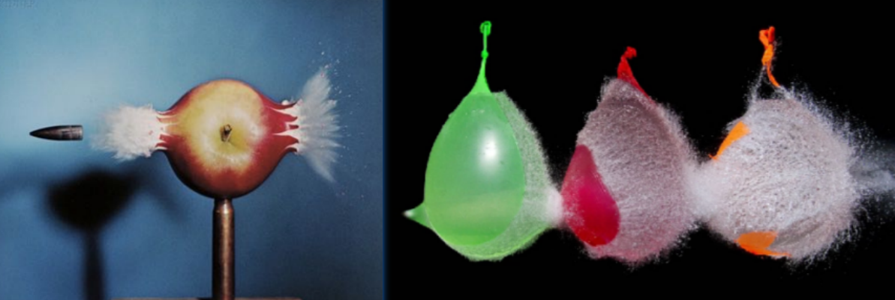
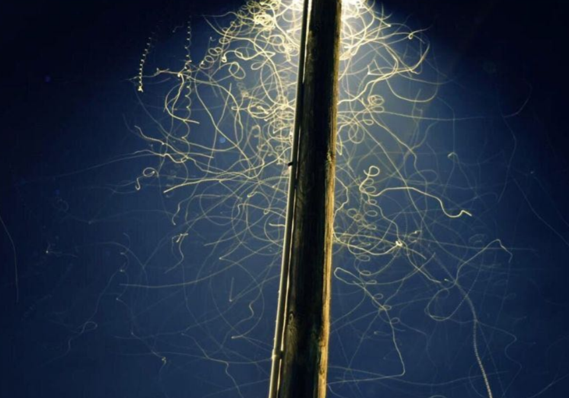
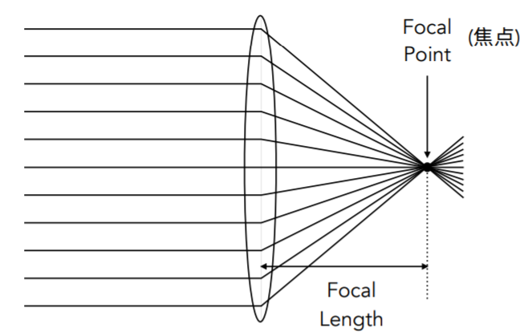
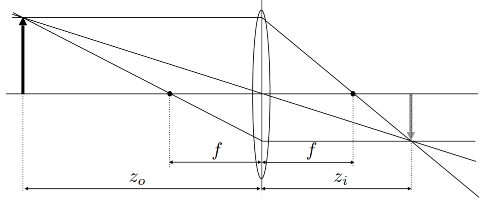
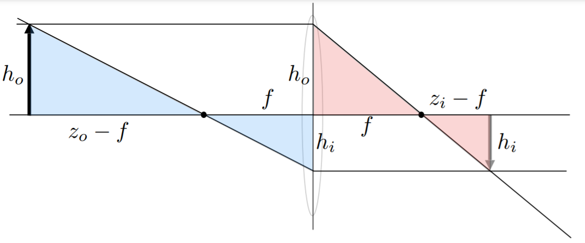
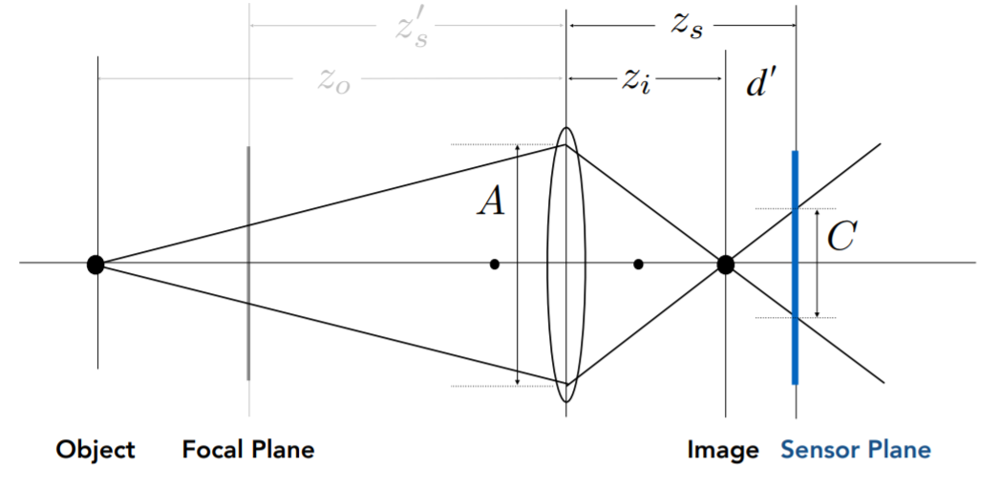
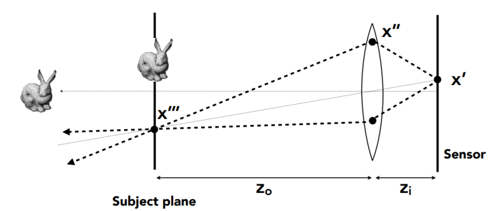

# Lecture 19 [相机、棱镜](https://sites.cs.ucsb.edu/~lingqi/teaching/resources/GAMES101_Lecture_19.pdf)

---

# 成像

- 光栅化/光线追踪——合成方式成像，生成自然界没有的物体；
- 照相机——捕捉成像

# Field of View（FOV）视场

- 视场用来描述拍摄的范围，​​​​​​​​​​​​​​​​​​​，h：高度，f：焦距。

  

- 对视场的影响因素

  - 焦距（Focal length）对视场（FOV）的影响：当传感器大小一定时，FOV 随着焦距增加而减少。通常在定义视场时，用以 35mm 格式的胶片为基准（35mm-format film，36 × 24 mm )的焦距来定义视场

    

  - 传感器大小对视场的影响：传感器越小，视场越小

    

  - 注意：在渲染中，传感器（Sensor）负责记录最后每个像素接受到的 Irradiance（指每单位照射面积所接收到的或者说入射的 power）有多大，最后的胶片（Film）决定最后图片的存储格式

# Exposure 曝光

### 曝光定义为 H，其计算公式：​​​​​

- T（曝光时间 Time）：由快门（shuttle）控制有多少光进来
- E（Irradiance）由传感器上一个单位区域接收光的能量和镜头的光圈（aperture，通俗理解用来遮挡光线用的）和焦距控制。
- 可以看出曝光记录的是总体时间的能量

### 曝光的影响因素

- 光圈大小 Aperture size：仿生学设计，模拟瞳孔，通过打开和关闭 apeture 改变 f-stop

  - 其中，镜头的 f-stop（也被叫做 f-number）写作 FN 或 F/N，大小为焦距除以光圈的直径

- 快门速度 Shuttle speed：改变 sensors 的曝光时间即每个像素接收光的时间，快门越快曝光越少。快门这个元件类似于一个窗帘，它的打开是有一个过程的

  

  - 运动模糊的形成：在快门打开的这段时间内，高速运动的物体已经发生了位移，中间的过程都会被记录下来。（Slow Speed vs. Fast Speed）

    

  - 运动模糊不一定是坏事，从人的感知角度它可以形容速度快；从采样角度，它也可以进行反走样。
  - 高速摄影 High-Speed Photography ：每秒拍更多的照片，也导致快门时间很少（短曝光时间）。

    

  - 延时摄影 Long-Exposure Photography

    

- 感光度 ISO gain：是一个后期处理，更改传感器值和数字图像值之间的倍率，但是 ISO 在简单放大信号的同时会放大噪声

# Thin Lens Approximation 薄透镜近似

- 真正的透镜非常复杂，需要一个简单的方法描述。

  

- 研究对象：Ideal Thin Lens - Focal Point 理想化薄透镜

  

  - 所有进入透镜的平行光一定过焦点。
  - 过交点的在透镜后面一定是平行光。
  - 认为焦距可以被随意改变（利用透镜组）。
  - The Thin Lens Equation 薄透镜公式（利用相似三角形推导）

    - ​​​​​​​​​​​​​​​​​​​​​​​​​​​​​​​​​​​​​​​​​​​

      
      

### Defocus Blur

- Computing Cicle of Confusion(CoC) Size

  

  - Object 远离 Focal Plane，聚焦后的点不在 Sensor Plane 上，而是在它前面聚焦，然后光线在聚焦点继续直线传播，到 Sensor Plane 上就变成了一个圆，这个圆就是 Cicle of Confusion(CoC)。因为其它很多点也可以透过透镜聚焦到同一个圆上
  - CoC 的计算公式如下，其中 A 是光圈直径，C 是 CoC 的直径。

    - ​​​​​​​​​​​​​​​​​​​​​​​​​​​​​​​​​​​​​​​​​​​​​​​​​​​​​​​​​​​​​​​​​​​​​​​​​​​
    - 可以看出：Circle of Confusion 与光圈大小成正比，所以看到的东西是否模糊与光圈的大小有关。
    - 将上面的公式与 F-Number 联系起来就得到如下公式：
    - ​​​​​​​​​​​​​​​​​​​​​​​​​​​​​​​​​​​​​​​​​​​​​​​​​​​​​​​​​​​​​​​​​​​​​​​​​​​​​​​​​​​​​​​​​​​​​

  - CoC 告诉我们，看到的图片是否模糊，取决于光圈大小，左图光圈大小 A=f/1.4，右图 A=f/22

    

### Ray Tracing Ideal Thin Lenses

- 小孔成像——从相机透过一个像素连线，无景深效果
- 模拟薄棱镜，可以产生景深效果，具体做法：

  

  - 建立场景

    

    - 先定义 Sensor 的大小（成像平面大小），然后定义透镜的属性，即焦距和光圈的大小。
    - 定义透镜和关注平面的距离 ​​​（物距）。
    - 根据透镜方程计算相应的深度 ​​​（相距）。

  - 渲染

    - 对于每个在 sensor 上的像素 ​​
    - 在 lens plane 上取样随机一点 ​​​
    - 根据透镜的属性可以计算通过透镜的光线会打到 ​​​​
    - 计算光线 ​​​​​​​​​​​​​​​​​​​ 的 radiance（发射的、反射的、折射的、接收的光线在每单位立体角、每单位垂直面积上的 power，同时指定了光的方向与照射到的表面所接受到的亮度。），最后记录在 ​​ 上

### Depth of Field 景深

- 光圈大小的不同会影响模糊的范围，景深就是在场景内对应的 CoC 足够小的距离范围，在这个范围内，CoC 的大小小于或等于一个像素的大小，就可以认为这一部分深度内的场景是锐利的，非模糊的。

  

- DOF 就是 Depth of Field，指成像清晰的一段范围。要做的事情：将 ​​​​​​​ 与焦距联系起来

  

- 最终可以得到以下结论（[一个在线网站](http://graphics.stanford.edu/courses/cs178/applets/dof.html)）

  
