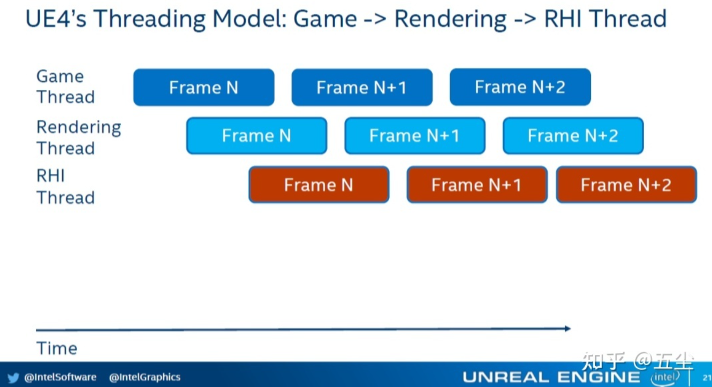

UE（Unreal Engine）是一种广泛使用的游戏引擎，它的渲染体系是其最重要的组成部分之一。UE的渲染体系包含许多不同的渲染技术，涵盖了从基本的几何形状、材质和光源到复杂的全局照明和后期处理。

- Engine\Source\Runtime\RendererCore。
- Engine\Source\Runtime\Renderer。
- Engine\Source\Runtime\RHI。
- 部分RHI模块（为了跨多种图形API，加入了RHI体系，解决用户层裸调用图形API的问题）：D3D12RHI，OpenGLDrv，VulkanRHI等。
- 部分基础模块：Core，CoreUObject等。

# UE的渲染流程

UE存在游戏线程（Game Thread）、渲染线程（Render Thread）、RHI线程（RHI Thread），它们都独立地运行在专门的线程上（FRunnableThread）。

**游戏线程**通过某些接口向渲染线程的Queue入队回调接口，以便渲染线程稍后运行时，从渲染线程的Queue获取回调，一个个地执行，从而生成了Command List。

**渲染线程**作为前端（frontend）产生的Command List是平台无关的，是抽象的图形API调用。

**RHI线程**作为后端（backtend）会执行和转换渲染线程的Command List成为指定图形API的调用（称为Graphical Command），并提交到GPU执行。

事实上，多线程并非多个渲染线程，渲染线程从始至终只有一个。这里的多线程指的是游戏线程、渲染线程、RHI线程同时存在，并行处理整个渲染过程。每个线程负责不同的任务而已。

此外，三个线程的处理速度并不一致，渲染线程在游戏线程的一两帧后操作。如果游戏线程跑的太快，游戏线程会在每个Tick事件的末尾阻塞，直到渲染线程赶上一到两帧的差距，才继续处理下一帧。



## **游戏线程**

游戏线程被称为主线程，是引擎运行的心脏，承载主要的游戏逻辑、运行流程的工作，也是其它线程的数据发起者。游戏线程的创建是运行程序入口的线程，由系统启动进程时被同时创建的（因为进程至少需要一个线程来工作），在引擎启动时直接存储到全局变量中。

游戏线程在Tick时，会通过UGameEngine、FViewport、UGameViewportClient等对象，才会进入渲染模块的调用。该线程完成的主要任务是：

- 资源加载：加载本地模型、材质等资源
- 场景搭建：将场景中的物体以特定的数据结构组织起来
- 之后会创**建场景渲染器**，并向渲染线程发送绘制场景指令，会进入渲染模块的调用

整个的Tick函数中跟渲染相关的逻辑精简后如下所示：

```cpp
void UGameEngine::Tick( float DeltaSeconds, bool bIdleMode )
{
    UGameEngine::RedrawViewports()
    {
        void FViewport::Draw( bool bShouldPresent)
        {
            void UGameViewportClient::Draw()
            {
                // 计算ViewFamily、View的各种属性
                ULocalPlayer::CalcSceneView();
                // 发送渲染命令
                FRendererModule::BeginRenderingViewFamily()
                {
                    World->SendAllEndOfFrameUpdates();
                    // 创建场景渲染器
                    FSceneRenderer* SceneRenderer = FSceneRenderer::CreateSceneRenderer(ViewFamily, ...);
                    // 向渲染线程发送绘制场景指令.
                    ENQUEUE_RENDER_COMMAND(FDrawSceneCommand)(
                    [SceneRenderer](FRHICommandListImmediate& RHICmdList)
                    {
                        RenderViewFamily_RenderThread(RHICmdList, SceneRenderer)
                        {
                            (......)
                            // 调用场景渲染器的绘制接口.
                            SceneRenderer->Render(RHICmdList);
                            (......)
                        }
                        FlushPendingDeleteRHIResources_RenderThread();
                    });
                }
}}}}
```

下面的一系列截图是从Tick函数开始到渲染线程的整个调用过程：


`FSceneRenderer`是UE场景渲染器父类，是UE渲染体系的大脑和发动机，在整个渲染体系拥有举足轻重的位置，主要用于处理和渲染场景，生成RHI层的渲染指令。

`FSceneRenderer`由游戏线程的`FRendererModule::BeginRenderingViewFamily`负责创建和初始化，然后传递给渲染线程。

渲染线程会调用`FSceneRenderer::Render()`，渲染完返回后，会删除`FSceneRenderer`的实例。也就是说，`SceneRenderer`会被每帧创建和销毁。

## **渲染线程**

渲染线程与游戏不同，是一条专门用于生成渲染指令和渲染逻辑的独立线程。游戏线程的对象通常做逻辑更新，在内存中有一份持久的数据，为了避免游戏线程和渲染线程产生竞争条件，会**在渲染线程额外存储一份内存拷贝，并且使用的是另外的类型：**


**FScene**是UWorld在渲染模块的代表，存在于`FSceneRenderer`中，只有加入到FScene的物体才会被渲染器感知到。渲染线程拥有FScene的所有状态（游戏线程不可直接修改）。


`FSceneRenderer`拥有两个子类：`FMobileSceneRenderer`和`FDeferredShadingSceneRenderer`。

`FDeferredShadingSceneRenderer`虽然名字叫做延迟着色场景渲染器，但其实集成了包含前向渲染和延迟渲染的两种渲染路径，是PC和主机平台的默认场景渲染器。在渲染线程中会着重讨论`FDeferredShadingSceneRenderer`。

细分`FDeferredShadingSceneRenderer::Render`的逻辑，则可以划分成以下主要阶段（在源码中可找到对应的函数）：


### UpdateAllPrimitiveSceneInfos

`FScene::UpdateAllPrimitiveSceneInfos`的主要作用是删除、增加、更新CPU侧的图元数据，包含变换矩阵、自定义数据、距离场数据等，并同步到GPU端。

### ****InitViews****

这是渲染管线的开始，这步是为渲染管线准备绘制当前帧所需要的各种资源。


- **`PreVisibilityFrameSetup`**：可见性判定预处理阶段，主要是初始化和设置静态网格、Groom、SkinCache、特效、TAA、ViewState等等。
- 初始化特效系统（`FXSystem`）。
- **`ComputeViewVisibility`**：计算视图相关的可见性，执行视锥体裁剪、遮挡剔除，收集动态网格信息，创建光源信息等。
    - FPrimitiveSceneInfo::UpdateStaticMeshes：更新静态网格数据。
    - ViewState::GetPrecomputedVisibilityData：获取预计算的可见性数据。
    - FrustumCull：视锥体裁剪。
    - **ComputeAndMarkRelevanceForViewParallel**：计算和标记视图并行处理的关联数据。
    - **GatherDynamicMeshElements**：收集view的动态可见元素。
    - **SetupMeshPass**：设置网格Pass的数据，将FMeshBatch转换成FMeshDrawCommand。
- `UpdateSkyIrradianceGpuBuffer`：更新天空体环境光照的GPU数据。
- `InitSkyAtmosphereForViews`：初始化大气效果。
- **`PostVisibilityFrameSetup`**：可见性判定后处理阶段，利用view的视锥裁剪光源，处理贴花排序，调整之前帧的RT和雾效、光束等。
- `View.InitRHIResources`：初始化视图的部分RHI资源。
- `OnStartRender`：通知RHI已经开启了渲染，以初始化视图相关的数据和资源。

### RenderPrePass

提前深度pass，只写入非透明物体的深度。

[虚幻4渲染编程(Shader篇)【第十四卷：PreZ And EarlyZ In UE4】 - 知乎 (zhihu.com)](https://zhuanlan.zhihu.com/p/81011375)

### ****BasePass****

**延迟渲染里的几何通道**，用来渲染不透明物体的几何信息，包含**法线、深度、颜色、AO、粗糙度、金属度**等等，这些几何信息会写入若干张GBuffer中。


`FParallelMeshDrawCommandPass::DispatchDraw`这个部分应该是当渲染命令设置完成后就执行`RenderBasePassInternal`函数中的`SetupBasePassState`所设置的着色器，再往下需要更多的研究才能看懂。

---

（待更新）

### ****LightingPass****

UE的LightingPass就是前面章节所说的光照通道。此阶段会计算开启阴影的光源的阴影图，也会计算每个灯光对屏幕空间像素的贡献量，并累计到Scene Color中。此外，还会计算光源也对translucency lighting volumes的贡献量。

Lighting Pass的负责的渲染逻辑多而杂，包含间接阴影、间接AO、透明体积光照、光源计算、LPV、天空光、SSS等等，但光照计算的核心逻辑在`RenderLights`

### **Translucency**

Translucency是渲染半透明物体的阶段，所有半透明物体在视图空间由远到近逐个绘制到离屏渲染纹理（separate translucent render target）中，接着用单独的pass以正确计算和混合光照结果。

### **PostProcessing**

后处理阶段，也是`FDeferredShadingSceneRenderer::Render`的最后一个阶段。包含了不需要GBuffer的Bloom、色调映射、Gamma校正等以及需要GBuffer的SSR、SSAO、SSGI等。此阶段会将半透明的渲染纹理混合到最终的场景颜色中。

## **RHI线程（Render Hardware Interface）**

**RHI**全称是**Render Hardware Interface（渲染硬件接口）**，是UE渲染体系中非常基础且重要的模块，封装了众多图形API（DirectX、OpenGL、Vulkan、Metal）之间的差异，对Game和Renderer模块提供了简便且一致的概念、数据、资源和接口，实现一份渲染代码跑在多个平台的目标。

RHI线程的工作是转换渲染指令到指定图形API，创建、上传渲染资源到GPU。`FRenderResource`是渲染线程的渲染资源代表，由渲染线程管理和传递，介于游戏线程和RHI线程的中间数据。

# 参考

[剖析虚幻渲染体系（02）- 多线程渲染 - 0向往0 - 博客园 (cnblogs.com)](https://www.cnblogs.com/timlly/p/14327537.html#25-ue%E7%9A%84%E5%A4%9A%E7%BA%BF%E7%A8%8B%E6%B8%B2%E6%9F%93)

[剖析虚幻渲染体系（04）- 延迟渲染管线 - 0向往0 - 博客园 (cnblogs.com)](https://www.cnblogs.com/timlly/p/14732412.html)

[剖析虚幻渲染体系（10）- RHI - 0向往0 - 博客园 (cnblogs.com)](https://www.cnblogs.com/timlly/p/15156626.html)

[虚幻引擎UE渲染框架 - 知乎 (zhihu.com)](https://zhuanlan.zhihu.com/p/484960867)

[虚幻4渲染编程（Shader篇）【第一卷：虚幻自身的延迟渲染管线】 - 知乎 (zhihu.com)](https://zhuanlan.zhihu.com/p/36630694?utm_campaign=shareopn&utm_medium=social&utm_oi=913827360451735552&utm_psn=1614073247485652992&utm_source=wechat_session)