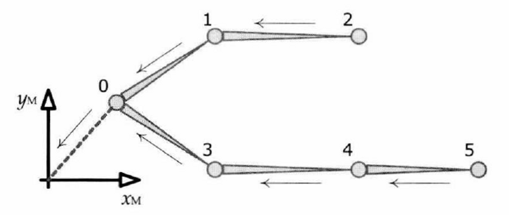
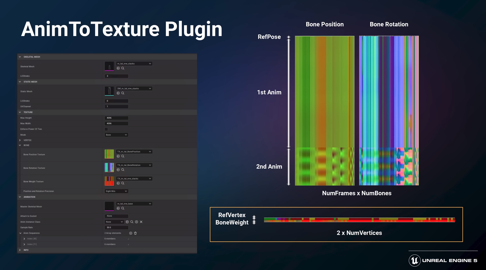

# 蒙皮/骨骼动画系统

对于游戏引擎中常用的蒙皮/骨骼动画系统，骨骼由刚性的“骨头”构建而成，渲染时并不会显示。

而称为“蒙皮”的光滑三角形网格（骨骼网格体，也可以叫做皮肤）会绑定于骨骼的“关节”上，其顶点会跟随骨骼的“关节”进行移动。

### 骨骼

骨骼由刚性的关节以层阶结构所构成，每个关节有且仅有一个父关节（除根关节）。而父关节与其子关节之间的长度就是一段骨骼的长度（关节可以理解为两根骨骼的连接处）。在骨骼文件中，存储的是关节信息。可以想象，如果旋转下图中的小臂，旋转的是小臂与大臂连接处的关节。

### 姿势

绑定姿势（参考姿势、放松姿势），是骨骼网格体绑定至骨骼之前的姿势。

在数学上，关节的姿势就是一个仿射变换，相对于父关节来指定，其仿射变换矩阵由平移矢量、3*3对角缩放矩阵、3*3旋转矩阵构成，整个骨骼的姿势就是所有关节姿势的仿射变换矩阵的集合。当把关节姿势的仿射变换施加到以**该关节坐标系**表示的点或矢量时，其变换结果是以父关节空间表示的该点或矢量，也就是把该关节坐标系的点或矢量变换到父关节坐标系。

上面提到的姿势还只是局部姿势，如果把关节姿势表示为模型空间（或者世界空间），称为全局姿势。

为了计算某个关节的全局姿势（或者说模型空间姿势），可以从该关节遍历至根关节，在每个关节上乘上其局部姿势即可（因为每乘一次局部姿势，就变换到上一级父关节空间）。

### 蒙皮

把三维网格顶点（骨骼网格体，或称皮肤）联系到骨骼的过程，即为蒙皮。初始时，骨骼网格体的顶点处于骨骼的绑定姿势所对应的位置，因此在资源中，通常骨骼资源和骨骼网格体资源的姿势是一样的。

三维建模师必须为每个顶点提供以下额外信息：

- 该顶点要绑定到的（最多4个）关节的索引；
- 每个被该顶点绑定的关节的权重因子（和为1，因此最后一个权重可以略去）。

游戏引擎通常限制每个顶点能绑定4个关节，原因在于：

- 4个8位的关节索引能方便得被包裹为一个32位字；
- 每个顶点绑定2、3、4个关节所产生的质量很容易区分，超过4个差别不大了

由于骨骼（实际上是关节）在动画过程中在不断变换，那么我们就需要**蒙皮矩阵**：把骨骼网格体的顶点从**骨骼的绑定姿势（初始姿势）的模型空间**变换至**骨骼的当前姿势的模型空间。**

下面介绍蒙皮矩阵的求法：

我们已知的是顶点处于绑定姿势（初始姿势）时在模型空间（初始位置）中的位置，而初始时，骨骼也是处于绑定姿势的。**当某个顶点绑定到关节的位置时，它在该关节坐标空间中的位置是不变的**，因此蒙皮矩阵的思路就是：

- 先将顶点处于绑定姿势（初始姿势）时在模型空间（初始位置）中的位置变换到所绑定的关节空间，即乘以该关节在绑定姿势时的全局姿势变换矩阵（将关节空间的点变换到根关节空间，即模型空间）的**逆矩阵**
- 由于整个的变换过程时关节在进行变换，所以改变的是关节的局部姿势，那么把关节从绑定姿势变换到当前姿势的变换矩阵是已知的，即乘以该**变换矩阵**
- 最后把顶点再转换回模型空间，乘以该关节在当前姿势时的全局姿势变换矩阵

联合后即得蒙皮矩阵。

# UE动画原理

[UE4 动画系统 源码及原理剖析_ue4 动画更新_Papals的博客-CSDN博客](https://blog.csdn.net/qq_23030843/article/details/109103433)

[UE4动画系统的那些事（一）：UE4动画系统基础 - 知乎 (zhihu.com)](https://zhuanlan.zhihu.com/p/62401630)

- UE4的角色动画采用了目前最流行的骨骼动画系统。骨骼动画系统大致可以分为两步：
1. 计算骨骼Pose：每一根骨骼可以看做一个点，而我们的Pose就是所有骨骼Transform（位移+旋转+缩放）的集合，注意，一般来说，这个Pose是基于骨架参考姿势（Reference Pose）的变换矩阵。
2. 蒙皮：骨骼计算好后我们还是无法看到一个角色的造型，这时需要将3D美术制作好的网格体的顶点按照骨骼Pose进行变化。这里变换的依据是顶点的蒙皮权重和参考姿势的信息（一个顶点可能受到多个骨骼的影响）。
- 动画系统更新过程简述

UE4里主要承担这两步职责的是`Skeletal Mesh Component`。`SkeletalMeshComponent`继承自`SkinnedMeshComponent`。在`SkeletalMeshComponent`创建时，会创建一个`Animation Instance`,这就是主要负责计算最终Pose的对象，而我们制作的`AnimationBlueprint`也是基于`UAnimationInstance`这个类的。在`SkeletalMeshComponent`进行Tick时，会调用`TickAnimation`方法，然后会调用`Animation Instance`的`UpdateAnimation()`方法，此方法会调用一遍所有动画蓝图中连接的节点的`Update_AnyThread()`方法，用来更新所有节点的状态。

然后后续根据设置的不同会从Tick函数或者Work线程中调用`SkeletalMeshComponent`的`RefreshBoneTransforms()`方法，此方法进而会调用动画蓝图所有节点的`Evaluate_AnyThread()`方法（注：部分节点类型此方法可能被屏蔽，后续拓展动画节点时会进行说明）。

`Evaluate`的含义就是指根据特定的条件（从`Update`时获得的参数）计算出动画所有骨骼的Transform信息，最后输出一个Pose给到渲染线程并存在本地Component上。

# 插件介绍

- AnimToTexture是UE5对VertexAnimToolset插件的改进，能在UE5.1中正常运行。
- 它可以将骨骼动画烘焙到材质贴图上，通过材质层读取贴图信息，结合Time实现动画效果。
- 该插件同时从选定的骨骼网格体创建静态网格体，可以将前面做好的材质应用到静态网格体上实现动画
- 这样一来，利用CPU计算骨骼动画的过程就通过材质信息移植到了GPU来计算，如果有大量网格体的时候，还可以享受合批渲染的性能节省。
- 除了骨骼动画贴图，该插件还可以生成顶点动画贴图，但是存储开销会变大，因此下面的介绍只涉及骨骼动画贴图。

# 原理简介

关于骨骼动画原理可见：

[UE 动画原理](https://www.notion.so/UE-68a64c0cec3749e189085893a6e8bca2)

通过插件可以生成三张贴图分别存储的是骨骼动画的位置信息、旋转信息和顶点绑定的权重信息。

- 右上角的两张贴图（骨骼动画的位置信息、旋转信息），每一列都是一块骨骼（其实是关节），每一行都是一帧动画，第一行是参考姿势（或者说绑定姿势），下面是不同动画片段的信息。如上图包含两段动画，他们是前后衔接的。
- 下面的贴图保存了两个信息，一个是静态网格体的顶点所对应的参考姿势下的位置，一个是每个顶点所绑定的的骨骼的权重。
- 

具体的内部实现，有时间看下源码再补充。

# 插件使用

## 准备工作

在编辑器中启用：

下载插件帮助工具AnimToTextureHelpers（见参考链接），注意不要用zip下载，用git clone或者单独下载这两个文件：

下载完了移动到UE编辑器的自定义文件夹下：

## 正式使用

右键运行编辑器工具控件：

选择一个你要使用的骨骼网格体，点击生成静态网格体：

可以看见左边生成了静态网格体，控件也会自动填充信息：

依次点击创建纹理、创建数据资产：

看到在同一个文件夹下会生成三张空的贴图和一个数据资产：

选择要烘焙的骨骼动画，这里我选择了三段：

点击设置参数，会自动填充到数据资产中：

这一步要注意找到设置参数的蓝图中，修改一下rotation tex和weight tex的位置，应该是作者不小心弄错了：

此时先不要点击烘焙按钮，先设置我们的动画材质，在原来的材质上做如下修改：

创建材质实例，勾选使用动画纹理的选项，可以看到图层参数这一栏，选择插件内置的一个材质层（**一般是自己定义，这样的话就可以自己设置每一段动画的播放参数，后续会补充这一块的教程）**

打开前面创建好的静态网格体，设置其材质插槽的值为刚刚创建的材质实例，会发现静态网格体是一团糟（后面会进行设置）：

接下来最重要的环节——烘焙，点击该按钮，插件会自动把烘焙好的材质应用到材质实例的材质图层上，并设定好参数：

回到静态网格体，看到已经可以按照先前设定好的三个动画片段播放了：

另外，关闭某些资产的时候，会出现下面的消息提示，全都选择“否”，不然会出现顶点位置偏移紊乱的情况，这个后续再看下是哪里的问题：

## 如何选择要播放的动画片段

在材质实例中设置，如下图，我只想播放第二个行走的动画片段，从数据资产“DA_SKM_Manny”中的信息栏-Animations找到索引1（也就是第二段动画），设置为如下参数。含义是将动画的起始位置设置为第二段动画的起始位置，播放的总帧数是第二段动画的总帧数。

这样一来，在插件内置的材质层中就会解析出对应的动画片段：

# 参考

- UE4的老插件：https://github.com/Rexocrates/Vertex_Anim_Toolset
- 新插件`AnimToTexture`视频教程：[Unreal Engine 5 AnimToTexture Plugin, How to Use it to make Vertex Animation Textures for crowds - YouTube](https://www.youtube.com/watch?v=vrlFozqB0jA)
- 新插件`AnimToTexture`的帮助工具：https://github.com/kromond/AnimToTextureHelpers
- 新插件`AnimToTexture`视频介绍8min：53s：[The Matrix Awakens: Creating the Characters | Tech Talk | State of Unreal 2022 - YouTube](https://www.youtube.com/watch?v=h_dJtk3BCyg)