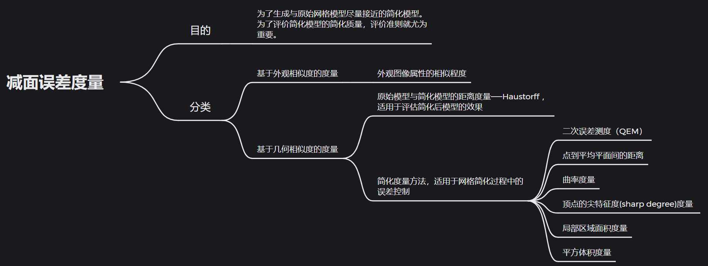

# 减面度量方法细化

# 综述
---
> **乔建成. 基于特征保持的网格简化算法研究[D].北京理工大学,2016.**

网格简化的初衷是为了生成与原始网格模型尽量接近的简化模型。为了评价简化模型的简化质量，评价准则就尤为重要。对于一个原始模型 M 及其简化模型 M’，用 E(M,M’) 来表示模型间的误差。

**1. 基于外观相似度的误差度量**

如果$I_1,I_2$分别是模型$M_1,M_2$的 RGB 光栅图像，可以用所有像素的均方差异来定义他们之间的不同：

$\left\|I_{1}-I_{2}\right\|_{i m g}=\frac{1}{m^{2}} \sum_{u} \sum_{v}\left\|I_{1}(u, v)-I_{2}(u, v)\right\|^{2}$

其中$\left\|I_{1}(u, v)-I_{2}(u, v)\right\|$是两个像素 RGB 向量$I_{1}(u, v),I_{2}(u, v)$之间的欧氏距离

优点：有利于在绘制系统中展示出比较好的结果。例如，对于一个复杂的飞机模型，视点一直在飞机的外边，模型内部的多边形并不会对模型的外观造成任何影响。

缺点：

① 重要视点的位置必须被考虑到。如果忽略了空间中一些重要的视点位置，视
觉上非常重要的特征会被移除。

② 由于每个采样视点位置可能需要昂贵的绘制代价，一般来说无法采样太多视点。

**2. 基于几何相似度的误差度量**

**为什么采用这种度量方法**：一般来说几何特征比较相似的模型，其外观相似度也比较高。而且度量模型的几何相似度，不需要对模型在不同的视点处采样，只要根据模型的数据文件即可。

模型间的距离可以通过两个点集之间的距离来度量，不妨设模型 A 上的点集为${a_1,a_2,...,a_m}$，模型 B 上的点集为${b_1,b_2,...,b_n}$。目前比较流行的几何相似度度量方法是 **Hausdorff** 距离：

$H(A, B)=\max \{h(A, B), h(B, A)\}$，其中，$h(A, B)=\max _{a \in A}\left(\min _{b \in B}\|a-b\|\right)$

若 $H(M,M')=d$ ，则说明原始模型 M 的所有点到简化模型 M’的距离小于 d ，同时简化模型 M’上的每一点到 M 的距离也不超过 d ，也就是说简化模型 M’ 很好的逼近了原始模型 M 。

基于此可以定义两个模型之间的平均误差：

$E_{\text {avg }}\left(M_{1}, M_{2}\right)=\frac{1}{k_{1}+k_{2}}\left(\sum_{v \in X_{1}} d_{v}^{2}\left(M_{2}\right)+\sum_{v \in X_{2}} d_{v}^{2}\left(M_{1}\right)\right)$

**Hausdorff** 距离和平均误差计算复杂，比较适用于评估简化后模型的效果，并不适合在简化模型中使用在模型简化中需要更简单的误差测度方法，如**二次误差度量**法则（下一篇论文提到）

基于二次误差度量准则，以下文献进行了改进：

>  Garland M, Heckbert P S. Simplifying surfaces with color and texture using quadric error metrics[C]//Proceedings of the conference on Visualization'98. IEEE Computer Society Press, 1998:263-269.
>  Fahn C S, Chen H K, Shiau Y H. Polygonal mesh simplification with face color and boundary edge preservation using quadric error metric[C]//Multimedia Software Engineering, 2002.Proceedings. Fourth International Symposium on. IEEE, 2002: 174-181.
>  Hua S M, Hu S M, Tai C L, et al. An effective feature-preserving mesh simplification scheme based on face constriction[C]//Computer Graphics and Applications, 2001.Proceedings. Ninth Pacific Conference on. IEEE, 2001: 12-21.
>  Cohen J, Olano M, Manocha D. Appearance-preserving simplification[C]//Proceedings of the 25th annual conference on Computer graphics and interactive techniques. ACM, 1998: 115-122.

---
> **钱勋波,罗立宏.一种保持特征的网格简化算法[J].机电工程,2017,34(10):1224-1228.**

二次误差测度（quadric error metrics，QEM）以点到平面的距离为误差标准，对原始模型中的每个三角形 Ti，求该三角形的邻域 Ci，对三角形 Ti 执行折叠操作后，得折叠点 vi0 到 Ci 中每个三角形所在平面距离的平方，最大值越小，简化模型与原始模型越相似。

三角形 Ti 的折叠误差计算公式：

其中：

---

> **张欣. 基于二次误差测度的三角网格简化算法研究[D].山东师范大学,2012.**

常用简化误差度量准则：

1.  二次误差测度
2.  点到平均平面的距离(相对简单)
    方法：计算顶点与平均平面的距离，该距离反映了该点周围区域内网格顶点的多少，距离的大小与周围顶点数目的多少成反比。即该顶点与周围邻接点的距离越小，表明该顶点周围的点比较密集；反之，距离越大，表明周围邻接点越稀少
    

    > 图：Schroeder W J , Zarge J A , Lorensen W E . Decimation of triangle meshes[J]. ACM SIGGRAPH Computer Graphics, 1997, 26(2):65-70.

3.  曲率度量
    **思想**：可以用曲率来描述三角网格物体的表面，曲率直观上代表着曲面的弯曲程度。
    **解释**：曲率越高表示曲面越不平坦，曲率越小表示该平面特征不明显，因而，通过平面的曲率可以轻松区分模型的特征区域，如人脸模型中的鼻梁、眼睛，牛模型中的牛角、牛蹄等部位。简化过程中，本着在进行简化时，可以在高曲率处保留尽量多的点，而在低曲率处早保持模型特征的前提下，删除尽量多的点。

    

    图：表面曲率。红色表示曲率较高的区域，蓝色表示相对平坦的区域

    > Turk G . Re-tiling polygonal surfaces[J]. Acm Siggraph Computer Graphics, 1992.

    **计算**：对于由函数$H(x,y)$ , 确定的曲面，曲率可通过以下式定义计算公式：

    $$
    \left(\frac{\partial^{2} H}{\partial x^{2}}\right)^{2}+2\left(\frac{\partial^{2} H}{\partial x \partial y}\right)^{2}+\left(\frac{\partial^{2} H}{\partial y^{2}}\right)^{2}
    $$

4.  顶点的尖特征度(sharp degree)度量
    **提出**：QEM 算法取得了很好的简化效果，但是为了能够在简化后的网格中依旧保持重要的细节特征，因此，提出尖特征边和顶点的尖特征度(sharp degree)的概念。
    **具体描述**：尖特征边——给定阈值 θ,对于某一边,如果与该边相连的两个面的二面角(定义二面角为两个面的外法线夹角)大于 θ,记该边为尖特征边.并规定在有边界的模型中,边界边为尖特征边；顶点的尖特征度——与顶点相邻的所有尖特征边的个数称为顶点的尖特征度.尖特征度是一个整数,最小值为 0,最大值为该顶点的度。
    **思想**：采用二次误差测度，用尖特征边、顶点尖特征度作为二次误差测度的加权因子。在选择边折叠算法进行减面时，将尖特征度加入到二次误差测度内,在原有的折叠误差公式的基础上加入一个惩罚项$C_{sharp}$，这样,模型中**尖特征度不为 0 的顶点**可以使得**误差测度值变大**，并且**尖特征度越大，误差测度值变得也越大**。由于边折叠是按误差测度值由小到大的顺序来进行的,因此尖特征度大的点进行边折叠的次序就越靠后.此外,加入该惩罚项后可以保持计算新顶点依旧是一个线性问题,这样便可以将所作的改进和 QEM 算法统一起来. 
    > 刘晓利, 刘则毅, 高鹏东,等. 基于尖特征度的边折叠简化算法[J]. 软件学报, 2005, 6(5):669-675. 
5.  局部区域面积度量
    **提出**：三角网格模型特征区域一般来说，有大量密集的三角形分布，这些三角形形状较小，而平坦区域往往分布数目少且形状较大的三角形。因为**三角形面积可直接反映三角形的大小，简化过程中需要优先简化平坦区域的面积较大的三角形**，因此引入局部区域面积度量方法 (local region area Measure，LRAM)来改变模型特征和平坦区域上的顶点的折叠次序。
    **思想**：局部区域面积(Local Region Area, LRA) 就是执行折叠操作时**发生变化的局部区域的
    面积**，它考察的是在网格简化中折叠三角形 T0 对邻接三角形的整体影响，将 LRA 作为特征保持控制因子，对 QEM 进行改进和统一。
    **计算**：一个三角形 T0 的局部区域由 T0 及它的邻接三角形 T1-T8 构成，该区域面积之和就是三角形 T0 的局部区域面积。
    

    > 刘艳艳, 王阳萍, 刘萍. 基于三角形折叠的保持外形特征的网格简化算法[J]. 兰州交通大学学报, 2011, 30(6):5.

6.  平方体积度量
    简化过后模型体积的变化，也能较为直观地反映简化模型与原始模型的差别。因而，相关研究人员提出了一种基于**体积平方度量**的三角形折叠网格简化算法，**简化模型与原始模型体积变化的平方确定为折叠误差**，同时将**三角形几何形状因子、三角形的法向因子**作为**加权因子**进一步约束三角形简化顺序，算法没有增加复杂度计算复杂度，简化结果好。

---

> **Li M , Nan L . Feature-preserving 3D mesh simplification for urban buildings[J]. ISPRS Journal of Photogrammetry and Remote Sensing, 2021, 2021(173):135-150.**

[Feature-preserving 3D mesh simplification for urban buildings.pdf](论文综述-建筑模型简化度量/Feature-preserving_3D_mesh_simplification_for_urban_buildings.pdf)

该篇研究的目标是建立一个全自动管道，在保持 BIM 建筑结构的同时缩小城巿建筑网格模型。该方法的目的不是一次处理整个城市场景，而是将场景中的单个建筑物逐一进行处理。

该研究所提出的全自动管道由三个主要模块组成：网格过滤、结构提取和网格抽取。简化可以滤除小尺度细节，结果可以形成多分辨率层次结构，以进行高效的几何处理以及细节级别(LOD)生成。
该研究的主要贡献有两个:

一是提出了一种网格滤波方法，可以逐步增强分段平滑度和锐利的轮廓特征。从而可以利用简单的区域增长算法从网格中提取平面形状，网格的结构由拓扑图表示，拓扑图由一组平面区域和经过网格过滤后检测到的轮廓内边缘组装而成。

特征提取过程概述。(a)初始网格;(b)基于区域增长的初步分类;(e)相似区域合并后的分割结果(d)两个细化的平面区域结构;(e)以红色描绘的轮廓内边缘。

二是提出了一种基于层次策略的细化网格抽取方法。与传统的网格抽取方法相比，使用了不同的策略为平面和非平面区域中的边缘塌陷算子设计误差度量。在上一步中检测到的平面用作约束，以避免在边缘折叠迭代期间错误累积。因此，简化模型尽可能地保留了原来的平面结构。

下面我们对比一下两种误差度量方法:
左图：在 GH 方法的原始边缘塌陷误差度量中(加兰和赫克伯特，1997)，每个顶点都与一个误差二次曲线 Q\_ p 相关联，它表示当前网格和初始网格之间的误差。该方法最小化从顶点 v 到其相邻面平面 P(包括顶点 a.bcd)的投影距离之和。请注意，二次曲线 Q p 是基于顶点 v 的所有相邻面计算的，该方法不考虑区域结构。因此，边缘的二次曲线也存在同样的问题，这可能会导致局部收敛。

右图改进:为了使边缘塌陷能够保留特征，改进的方法分析相邻面和区域结构以设计边缘的分层误差二次曲线。如果 v 的所有相邻面都属于一个平面区域 P，我们根据 P.而不是 v 的相邻面计算 v 的误差二次曲线 Q，否则，我们继续使用传统的误差二次曲线

平面区域组对边缘塌陷误差的影响如图所示，其中虚线表示支撑平面。

使用 GH 的误差二次曲线的算子的局限性在于——仅使用可能受噪声影响的相邻面的局部几何信息。如果相邻的面在更大的范围内是接近平面的，那么结果就不能反映这种特性。

而改进的误差度量将平面区域组视为一个整体，新的顶点会自动迁移到平面上。边缘塌陷操作的误差度量的分层定义确保了所提出的方法对不同数据的适应性更强

方法优势对比：(a)初始网格模型，(b)我们的平滑模型，(c)我们的简化结果，(d)GH 方法产生的结果)(Garland and Heckbert, 1997)，(e)LT 方法产生的结果(Lindstrom and Turk, 1998)，(f) SLA 方法产生的结果(Salinas et al.，2015)。所有方法都将模型简化为 50 个顶点。

减面效果度量标准：

**1.平均误差。**
为了评估减面结果的准确性，根据原始模型的顶点与简化模型的面之间的距离来计算误差。具体来说，计算从原始模型顶点到简化模型上最近的面的距离，距离的平均值用于评估几何精度。

上述方法的时间消耗与几何精度(平均误差）对比发现，该研究的方法在运行时间上不如其他方法，但在结果准确性方面具有明显优势。

**2.噪声容限**
下图所示的模型是手动设计的，并被不同程度的噪声破坏。我们可以观察到过滤结果和区域提取的质量对于噪声水平是稳定的。此度量标准是通过对模型进行不同程度的噪声干扰，观察其最终的减面效果。

达到的效果如下图所示，描述了航空摄影测量模型的简化过程。从(a)到(f)分别为：初始网格，网格过滤结果，区域增长结果，提取的平面区域结构，轮廓特征，以及最终的简化结果。

